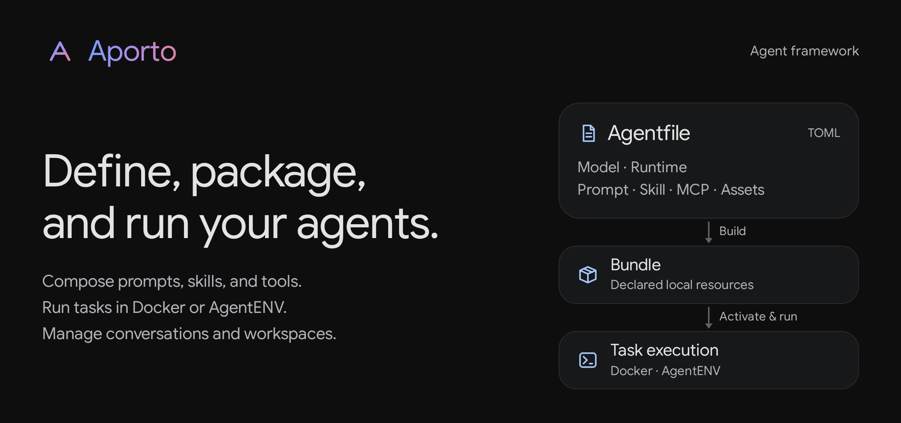
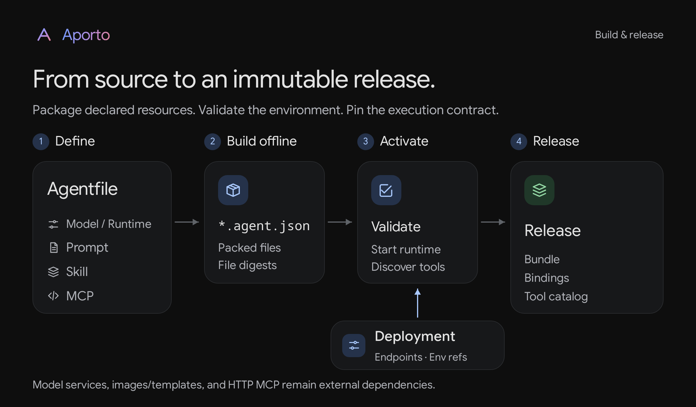
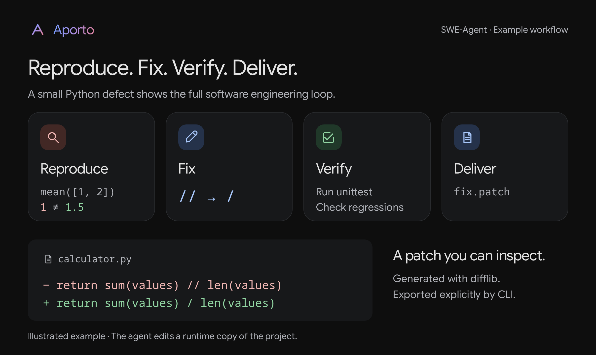
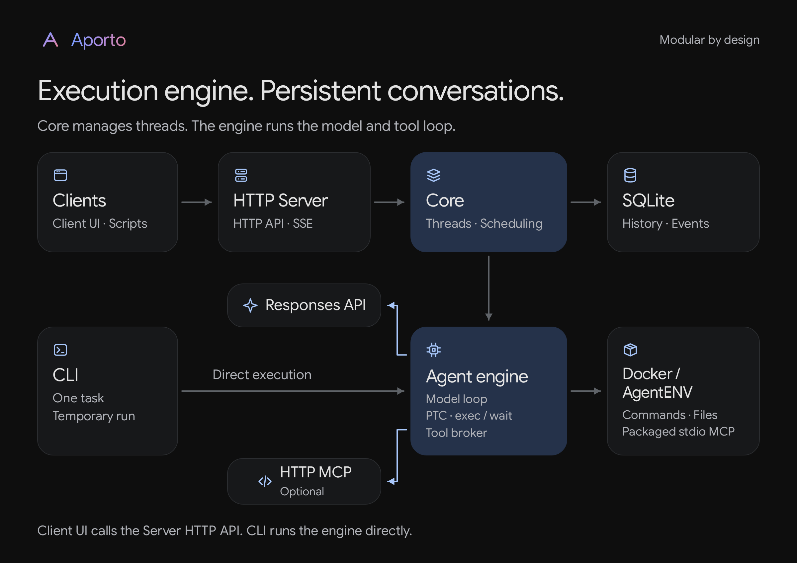

# Aporto

**Define, package, and run your agents.**

[简体中文](README.zh-CN.md) · [Agentfile reference](docs/agentfile.md) · [Architecture](docs/architecture.md) · [Contributing](CONTRIBUTING.md)



Aporto is a framework for building and running custom agents. It connects agent definitions and resource packaging with deployment and task execution, including server-side conversation and workspace management.

- **Define and package:** a TOML **Agentfile** declares model settings, prompts, skills, MCP servers, and the runtime. Explicit local resources are bundled offline; deployment connections and credentials are configured separately. Workspace or home-directory MCP, skills, and `AGENTS.md` are never auto-loaded.
- **Run in managed environments:** use local Docker or [AgentENV](https://github.com/kvcache-ai/AgentENV) in local or remote mode. Choose a configured image or template when creating an instance, and set the working directory. Service mode also supports reusing instances managed by Aporto.
- **Continue work across turns:** Core stores conversation history and execution events, supports task interruption, and manages workspaces so later turns can continue with existing files. Turns sharing an instance run serially.

Aporto is intended for **trusted, single-tenant deployments**. It does not provide tenant isolation or a hardened boundary for hostile code. See [security](SECURITY.md) and the [runtime lifecycle](docs/architecture.md#sandbox-生命周期) before deploying it.

## Build an agent

This walkthrough builds Aporto's **SWE-Agent (`swe-agent`)** example: reproduce a bug, modify code, run regression tests, and deliver a patch. Both the CLI and the conversation service execute an activated release of this agent.



Use Linux with Rust **1.93.0**, a C build toolchain, Python 3, and a local Docker CLI/daemon accessible through a Unix socket. The API examples also use `curl`; the UI needs Node.js **24**. Docker does not require KVM. Run the commands from the repository root using Bash.

### 1. Create the agent source

Build Aporto and copy the starter into a local directory:

```bash
cargo build --release --workspace --locked
docker --host unix:///var/run/docker.sock pull python:3.12-slim

mkdir -p .aporto
cp -R examples/swe-agent .aporto/swe-agent
```

The starter packages a software engineering prompt, a debugging skill, and a Python MCP server that supplies engineering guidelines. It also includes a small Python project with a reproducible bug:

```text
.aporto/swe-agent/
├── Agentfile
├── deployment.toml
├── prompts/swe-agent.md
├── skills/software-engineering/SKILL.md
├── mcp/project/
│   ├── server.py
│   └── guidelines.json
└── workspace/
    ├── calculator.py
    └── tests/test_calculator.py
```

Edit `.aporto/swe-agent/Agentfile`. Replace `YOUR_MODEL_ID` with a model your provider supports that can use Responses custom tools. Customize the local prompt, skill, and MCP files for your agent.

```toml
[agent]
name = "swe-agent"

[model]
name = "YOUR_MODEL_ID"
connection = "primary"

[runtime]
provider = "docker"
image = "python:3.12-slim"
workdir = "/workspace"

[[prompts]]
source = "prompts/swe-agent.md"

[[skills]]
source = "skills/software-engineering"

[[mcp]]
name = "project"
source = "mcp/project"
command = ["python3", "server.py"]
```

Resource paths are relative to the build context. Only declared resources are packaged; the task workspace is not a configuration source. The Agentfile fixes the runtime provider and allowed images or templates. For multiple images, external directories, HTTP MCP, or AgentENV templates, see the [complete Agentfile examples](examples/agentfile/README.md).

`workspace/` is the sample task input, not a packaged Agentfile resource. Its `mean([1, 2])` returns `1` instead of `1.5`; the included regression test fails until the agent fixes the implementation. The example uses Python's standard library and can run with Docker networking disabled.

### 2. Configure the deployment

Edit `.aporto/swe-agent/deployment.toml` with your provider's **full Responses endpoint**. Aporto does not append a path. The minimal configuration is:

```toml
[connections.primary]
endpoint = "https://api.openai.com/v1/responses"
api_key = { env = "OPENAI_API_KEY" }

[[agents]]
id = "swe-agent"
bundle = "swe-agent.agent.json"

[agents.runtime]
host = "unix:///var/run/docker.sock"
network = "none"
```

`model.connection = "primary"` selects `connections.primary`. The deployment's `agents.id` is the identifier passed to CLI `--agent`, API `agent_id`, and the UI agent selector. This walkthrough keeps it as **`swe-agent`**. The bundle path is relative to the deployment file, not the shell's working directory. Credentials are read from the named environment variable; do not write their values into these files.

### 3. Build and activate

Package the source and inspect the result:

```bash
./target/release/aporto build .aporto/swe-agent \
  -o .aporto/swe-agent/swe-agent.agent.json
./target/release/aporto inspect .aporto/swe-agent/swe-agent.agent.json
```

`build` works offline and does not call the model, execute MCP, or build or pull runtime images. The resulting `swe-agent.agent.json` contains the declared resources and their integrity metadata. Model services, runtime images or templates, and remote MCP services remain external dependencies.

Set the model credential, then activate the bundle against the configured runtime:

```bash
read -rsp 'Model API key: ' OPENAI_API_KEY
export OPENAI_API_KEY

./target/release/aporto activate \
  --config .aporto/swe-agent/deployment.toml --agent swe-agent
```

Activation starts temporary runtimes, discovers MCP tool catalogs, and records an immutable release under `.aporto/swe-agent/releases/` after cleanup succeeds. It does not call the model or execute a user task.

The release fixes packaged resources, connection settings, and the tool catalog. Docker image IDs and daemon identity are pinned; AgentENV template identity remains unverified. External services are not frozen by the release. See the [Agentfile reference](docs/agentfile.md) for activation details.

CLI and Core require an activated release. Keep `OPENAI_API_KEY` available in the shell that runs the CLI or Server; a new shell must set it again.

After editing agent resources or the Agentfile, rebuild and activate again. After changing deployment settings, activate again. Restart a running Core/Server to load the new active release; existing threads retain their original release.

## Invoke the agent



Choose CLI execution for a single task or the HTTP service for persistent conversations. Client UI is a client of that HTTP service:

| Interface | Call path | Behavior |
| --- | --- | --- |
| CLI | CLI → Engine | One task in a temporary runtime; optionally upload local files and export results. No Server or Core required. |
| HTTP API | HTTP client → Server API → Core → Engine | Create a persistent thread, submit turns, and retrieve progress and answers. |
| Client UI | Client UI → Server API → Core → Engine | Use the HTTP service interactively, including conversations created by other HTTP clients. |

### CLI: run a task

Run SWE-Agent against the included buggy project using the same deployment and agent ID:

```bash
./target/release/aporto run \
  --config .aporto/swe-agent/deployment.toml --agent swe-agent \
  --workspace .aporto/swe-agent/workspace \
  --task 'Fix mean([1, 2]) returning 1 instead of 1.5. Reproduce the failing test, fix the code, run python3 -m unittest discover -s tests -v, and write fix.patch as a unified diff against the original files.' \
  --export fix.patch=./fix.patch
```

The final answer reports the fix and test results; `fix.patch` is exported to the current host directory. To work on your own project, replace `--workspace` and the task description. Apply the exported patch from that project's root after inspecting it. `--workspace` uploads a bounded snapshot of project files, rather than mounting the host directory. Omit it for a task that needs no existing files. `--workdir /projects/demo` can override the container working directory; `--image` selects an image already allowed by the activated agent.

The default image includes Python 3 and does not require Git for this example. The packaged skill describes how to produce a unified diff with Python `difflib` from original file snapshots. Projects that need other runtimes or dependencies should use a prepared image declared in the Agentfile.

The CLI reads the activated release and calls the engine directly; it does not connect to Server or Core or create a UI conversation. It normally deletes its temporary runtime when finished, so use `--export` for files you want to keep. For persistent multi-turn work, use the HTTP API, directly or through Client UI.

### Start Server for API and UI

In a shell with the model credential set, create a separate client token and start Server. Leave it running while using either entry point:

```bash
export APORTO_SERVER_TOKEN="$(python3 -c 'import secrets; print(secrets.token_hex(32))')"
printf 'Client token: %s\n' "$APORTO_SERVER_TOKEN"

./target/release/aporto-server \
  --core-bin ./target/release/aporto-core \
  --core-config .aporto/swe-agent/deployment.toml \
  --state-dir .aporto/state \
  --listen 127.0.0.1:8080 --allow-origin http://localhost:5173
```

Copy the printed **client token** for the API or UI. Clients never need the model API key. Server starts its own Core and saves conversations in `.aporto/state`; only one Core can own that directory.

These localhost URLs assume the client runs on the same machine. For remote access, configure the API URL, allowed origin, and TLS as described in the [deployment guide](docs/http-server.md).

### HTTP API: create a conversation and submit a task

In another terminal, enter the token printed by Server and confirm `swe-agent` appears in the agent list:

```bash
export APORTO_API_URL=http://localhost:8080
read -rsp 'Server token: ' APORTO_SERVER_TOKEN
export APORTO_SERVER_TOKEN

curl --fail-with-body -sS "$APORTO_API_URL/v1/agents" \
  -H "Authorization: Bearer $APORTO_SERVER_TOKEN" | python3 -m json.tool
```

Create a thread bound to that agent. The request below uses a new instance and the agent's default image:

```bash
APORTO_THREAD_ID=$(curl --fail-with-body -sS "$APORTO_API_URL/v1/threads" \
  -H "Authorization: Bearer $APORTO_SERVER_TOKEN" \
  -H 'Content-Type: application/json' \
  --data '{"agent_id":"swe-agent","title":"Fix mean integer division","runtime":{"mode":"new"},"workdir":"/workspace"}' \
  | python3 -c 'import json,sys; print(json.load(sys.stdin)["id"])')
```

The response is HTTP **201** with a `Thread` object; its root `id` is the thread ID. Submit the first task:

```bash
APORTO_TURN_ID=$(curl --fail-with-body -sS "$APORTO_API_URL/v1/threads/$APORTO_THREAD_ID/turns" \
  -H "Authorization: Bearer $APORTO_SERVER_TOKEN" \
  -H 'Content-Type: application/json' \
  --data '{"input":"Create a Python project with mean(values) implemented as sum(values) // len(values), and a unittest expecting mean([1, 2]) == 1.5. Run the test to reproduce the failure, fix the implementation, rerun the test, and write fix.patch against the original buggy files.","idempotency_key":"readme-fix-1"}' \
  | python3 -c 'import json,sys; print(json.load(sys.stdin)["id"])')
printf 'Thread: %s\nTurn: %s\n' "$APORTO_THREAD_ID" "$APORTO_TURN_ID"
```

The response is HTTP **202** with a `Turn` object, acknowledging submission rather than returning the final answer. Read the thread to retrieve the task's status and result:

```bash
curl --fail-with-body -sS "$APORTO_API_URL/v1/threads/$APORTO_THREAD_ID" \
  -H "Authorization: Bearer $APORTO_SERVER_TOKEN" | python3 -m json.tool
```

In `turns`, find the entry whose `id` equals `APORTO_TURN_ID`. Repeat this read until its `status` is `completed`, `failed`, or `interrupted`. A completed turn contains the final answer in `output`; failures include `error`. The source, tests, and `fix.patch` remain in the runtime for subsequent turns.

To watch assistant messages and tool activity, use the thread's SSE stream:

```bash
curl --fail-with-body -sS -N "$APORTO_API_URL/v1/threads/$APORTO_THREAD_ID/events?after=0" \
  -H "Authorization: Bearer $APORTO_SERVER_TOKEN"
```

This replays events from sequence 0 and continues streaming. It stays open after the turn finishes; Ctrl-C closes the subscription without cancelling the task. To resume a stream, use the last received event ID as `after`. To explicitly interrupt a task while it is active:

```bash
curl --fail-with-body -sS -X POST \
  "$APORTO_API_URL/v1/threads/$APORTO_THREAD_ID/turns/$APORTO_TURN_ID/interrupt" \
  -H "Authorization: Bearer $APORTO_SERVER_TOKEN"
```

For the next message, POST to the same thread's `/turns` route with a new `input` and `idempotency_key`. Wait for the previous turn to finish first. Retrying the same logical submission must preserve both its key and input; the key `readme-fix-1` above belongs only to that first message. Thread reads default to the latest 20 turns; full pagination and instance-reuse requests are in the [HTTP reference](docs/http-server.md).

### UI: chat with the agent

Start the client in another terminal:

```bash
npm --prefix apps/web ci
npm --prefix apps/web run dev
```

1. Open [http://localhost:5173](http://localhost:5173), connect to `http://localhost:8080`, and enter the Server client token.
2. Click **新建会话**, select **swe-agent**, then choose **新建实例** or **复用实例**. For a new instance, choose an allowed image and working directory, then click **创建会话**.
3. Use the self-contained bug-fix task from the API example above, or ask: “Create a Python mean function that incorrectly uses integer division, write a failing test for mean([1, 2]) == 1.5, then fix it, rerun the tests, and produce fix.patch.” Click the send arrow or press Ctrl/⌘+Enter.
4. Watch the assistant's messages and expandable tool activity. The stop icon interrupts an active task. When it finishes, send another message to continue in the same workspace.

Client UI uses the HTTP API to access Core's persistent threads. Conversations created by other HTTP clients appear in the UI's conversation list after connecting to the same Server; CLI tasks do not. Reusing an instance retains its release, image or template, and files while starting a separate conversation history. Turns sharing an instance run serially.

**API/UI do not upload the repository you are browsing or your current host directory.** Their working-directory field is a path inside the runtime. A new instance starts from the selected image, so the API/UI task explicitly creates the buggy project and its test before fixing it. The CLI example uploads the included `workspace/` instead. Use CLI `--workspace` for local project upload. See the [client guide](apps/web/README.md) for production UI deployment.

## Components



| Path | Responsibility |
| --- | --- |
| `src/` | Agentfile, bundles, releases, Responses client, PTC, MCP, and runtime adapters; `aporto` CLI |
| `crates/protocol/` | Shared JSON-RPC types and generated protocol schema |
| `crates/core/` | Persistent threads, turn scheduling, cancellation, and runtime lifecycle |
| `crates/core-client/` | Core process supervision and asynchronous RPC client |
| `crates/server/` | Bearer-authenticated HTTP API and resumable SSE |
| `apps/web/` | Independently built React/TypeScript client |

The engine is implemented in Rust. Tool calls currently use only programmatic tool calling (PTC): the model uses `exec` / `wait` to orchestrate `tools.*` in JavaScript, including concurrent calls. Model connections support the Responses API only.

Core can run directly over stdin/stdout for other clients. The HTTP server supervises its own Core process; only one Core may own a state directory.

## Documentation

The detailed design and protocol references are currently in Chinese.

- [Agentfile and deployment specification](docs/agentfile.md) · [Examples](examples/agentfile/README.md)
- [Architecture and operational limits](docs/architecture.md) · [Design decisions](docs/design.md)
- [HTTP API and production deployment](docs/http-server.md) · [Conversation events](docs/conversation.md)
- [Docker runtime and CLI file export](docs/docker-runtime.md) · [AgentENV configuration](examples/agentfile/README.md)
- [Client development and deployment](apps/web/README.md) · [Validation guide](docs/validation.md)
- [Editable README illustrations and export instructions](docs/visuals/README.md)

Docker service workspaces stop after each turn and start again on the next turn, preserving files but not process memory. AgentENV pauses and reconnects its sandbox. The one-shot CLI deletes its runtime on normal completion; use `--export` to retain output files. See the runtime guides for cleanup and recovery behavior.

## Development

```bash
cargo fmt --all -- --check
cargo clippy --workspace --all-features --locked --all-targets -- -D warnings
cargo test --workspace --all-features --locked
npm --prefix apps/web ci
npm --prefix apps/web test
```

[CONTRIBUTING.md](CONTRIBUTING.md) covers browser tests, process integration, schema generation, and preparing a release. CI runs fixture-based AgentENV tests and real Docker integration. Real-model checks are opt-in; real AgentENV microVM validation requires a separately deployed service.

## License

[Apache-2.0](LICENSE). See [third-party notices](THIRD_PARTY_NOTICES.md) and the bundled fonts' [upstream licenses](docs/fonts.md). Aporto is an independent project inspired by Codex; it is not an official OpenAI or Google product.
