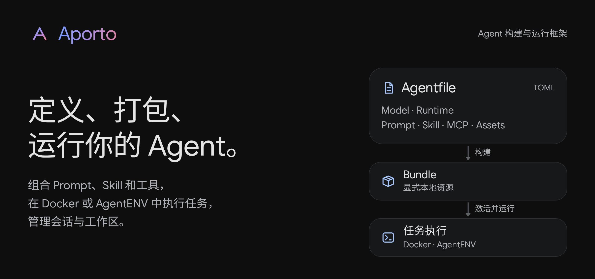
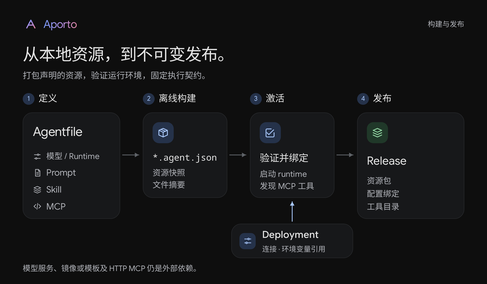
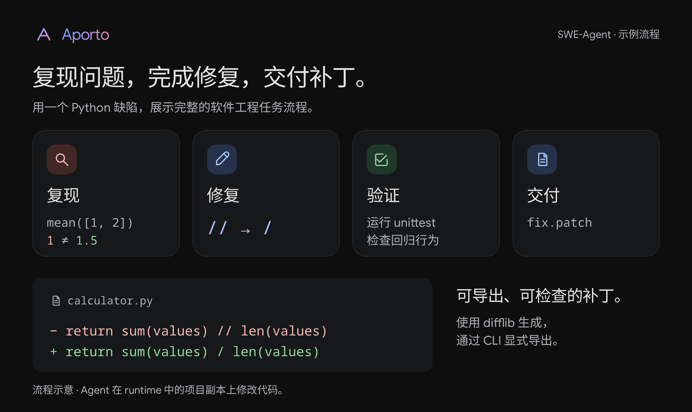
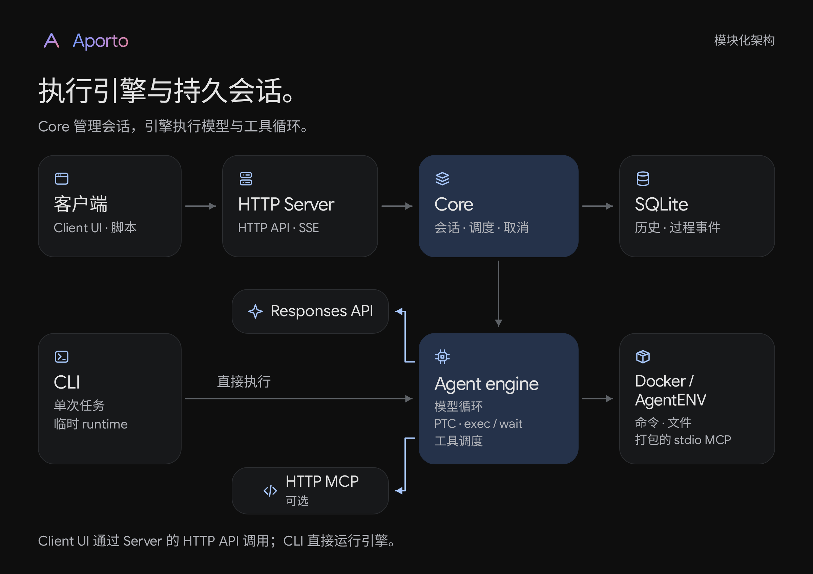

# Aporto

**定义、打包、运行你的 Agent。**

[English](README.md) · [Agentfile 规范](docs/agentfile.md) · [架构](docs/architecture.md) · [参与开发](CONTRIBUTING.md)



Aporto 是一个自定义 Agent 的构建与运行框架，覆盖 Agent 定义、资源打包和部署运行，并由服务端管理会话与工作区。

- **定义与打包**：通过标准 TOML **Agentfile** 声明模型配置、Prompt、Skill、MCP 和 runtime，离线打包显式本地资源；部署连接和凭据单独配置。不自动加载 runtime workspace 或 HOME 中的 MCP、Skill、`AGENTS.md`。
- **运行任务**：支持本机 Docker，以及 [AgentENV](https://github.com/kvcache-ai/AgentENV) local / remote。新建实例时可选择已配置的镜像或模板，并指定工作目录；服务模式下也可复用 Aporto 管理的实例。
- **持续工作**：Core 保存对话历史和执行事件，支持中断任务，并管理工作区，供后续轮次继续使用已有文件；共享同一实例的任务串行执行。

当前面向**受信任的单租户部署**，没有租户隔离，也不提供运行恶意代码所需的完整隔离边界。部署前请阅读[安全说明](SECURITY.md)和[运行实例生命周期](docs/architecture.md#sandbox-生命周期)。

## 构建一个 Agent

下面构建 Aporto 的 **SWE-Agent（`swe-agent`）** 示例，完成复现 bug、修改代码、回归验证和生成补丁的流程。CLI 和对话服务均执行此 Agent 已激活的 release。



需要 Linux、Rust **1.93.0**、C 编译工具链、Python 3，以及可通过 Unix socket 访问的本机 Docker CLI / daemon。API 示例还需要 `curl`，UI 需要 Node.js **24**。Docker 不需要 KVM。以下命令使用 Bash，在仓库根目录执行。

### 1. 创建 Agent 源目录

编译 Aporto，将示例复制到本地目录：

```bash
cargo build --release --workspace --locked
docker --host unix:///var/run/docker.sock pull python:3.12-slim

mkdir -p .aporto
cp -R examples/swe-agent .aporto/swe-agent
```

示例打包软件工程 Prompt、调试 Skill 和提供工程规范的 Python MCP Server，并附带一个可以复现 bug 的小型 Python 项目：

```text
.aporto/swe-agent/
├── Agentfile
├── deployment.toml
├── prompts/swe-agent.md
├── skills/software-engineering/SKILL.md
├── mcp/project/
│   ├── server.py
│   └── guidelines.json
└── workspace/
    ├── calculator.py
    └── tests/test_calculator.py
```

编辑 `.aporto/swe-agent/Agentfile`，将 `YOUR_MODEL_ID` 替换成所用服务支持的模型，模型须支持 Responses custom tools。按需修改目录中的 Prompt、Skill 和 MCP 文件：

```toml
[agent]
name = "swe-agent"

[model]
name = "YOUR_MODEL_ID"
connection = "primary"

[runtime]
provider = "docker"
image = "python:3.12-slim"
workdir = "/workspace"

[[prompts]]
source = "prompts/swe-agent.md"

[[skills]]
source = "skills/software-engineering"

[[mcp]]
name = "project"
source = "mcp/project"
command = ["python3", "server.py"]
```

资源路径相对于构建上下文，只打包显式声明的资源；任务 workspace 不作为配置来源。runtime provider 和允许的镜像或模板由 Agentfile 固定。多镜像、外部目录、HTTP MCP 和 AgentENV 模板配置见[完整 Agentfile 示例](examples/agentfile/README.md)。

`workspace/` 是示例任务输入，不作为 Agentfile 资源打包。其中 `mean([1, 2])` 错误返回 `1`，预期为 `1.5`；附带的回归测试会失败，直到 Agent 修复实现。示例仅使用 Python 标准库，可在 Docker 禁网环境运行。

### 2. 配置部署连接

编辑 `.aporto/swe-agent/deployment.toml`，填写服务提供的**完整 Responses endpoint**，Aporto 不自动追加路径。最小配置如下：

```toml
[connections.primary]
endpoint = "https://api.openai.com/v1/responses"
api_key = { env = "OPENAI_API_KEY" }

[[agents]]
id = "swe-agent"
bundle = "swe-agent.agent.json"

[agents.runtime]
host = "unix:///var/run/docker.sock"
network = "none"
```

`model.connection = "primary"` 对应 `connections.primary`。部署配置里的 `agents.id` 是调用标识，用于 CLI 的 `--agent`、API 的 `agent_id` 和 UI 的 Agent 选择；本例统一为 **`swe-agent`**。bundle 路径相对于 deployment 文件所在目录，不相对于当前命令目录。凭据从指定环境变量读取，不要将实际密钥写入这些文件。

### 3. 构建并激活

打包资源，检查构建结果：

```bash
./target/release/aporto build .aporto/swe-agent \
  -o .aporto/swe-agent/swe-agent.agent.json
./target/release/aporto inspect .aporto/swe-agent/swe-agent.agent.json
```

`build` 离线执行，不调用模型、不执行 MCP、不构建或拉取运行镜像。生成的 `swe-agent.agent.json` 包含声明的资源及完整性元数据。模型服务、运行镜像或模板、远程 MCP 服务仍是外部依赖。

设置模型凭据，然后在配置的 runtime 上激活：

```bash
read -rsp 'Model API key: ' OPENAI_API_KEY
export OPENAI_API_KEY

./target/release/aporto activate \
  --config .aporto/swe-agent/deployment.toml --agent swe-agent
```

激活会启动临时 runtime、发现 MCP 工具目录，清理成功后在 `.aporto/swe-agent/releases/` 生成不可变 release，不调用模型或执行用户任务。

Release 固定打包资源、连接配置和工具目录。Docker 镜像 ID 与 daemon 身份会被固定；AgentENV 模板身份仍标记为未验证。Release 不保证外部服务的实现不变，具体边界见 [Agentfile 规范](docs/agentfile.md)。

CLI 和 Core 都要求 Agent 已激活。运行 CLI 或 Server 的终端需要保留 `OPENAI_API_KEY`；另开终端时需重新设置。

修改 Agentfile 或资源文件后，需要重新 build、activate；修改部署设置后，需要重新 activate。正在运行的 Core / Server 需要受控重启才能加载新的 active release；已有会话继续使用原 release。

## 调用这个 Agent



单次任务使用 CLI，持久对话使用 HTTP 服务；Client UI 是该 HTTP 服务的客户端：

| 接口 | 调用路径 | 行为 |
| --- | --- | --- |
| CLI | CLI → Engine | 临时 runtime 中执行单次任务，可上传本地项目并导出结果，不需要 Server 或 Core。 |
| HTTP API | HTTP 客户端 → Server API → Core → Engine | 创建持久会话、提交任务、读取过程和最终回答。 |
| Client UI | Client UI → Server API → Core → Engine | 通过 HTTP 服务交互，也可查看其他 HTTP 客户端创建的会话。 |

### CLI：执行单次任务

使用相同 deployment 和 Agent ID，让 SWE-Agent 修复附带的示例项目：

```bash
./target/release/aporto run \
  --config .aporto/swe-agent/deployment.toml --agent swe-agent \
  --workspace .aporto/swe-agent/workspace \
  --task 'Fix mean([1, 2]) returning 1 instead of 1.5. Reproduce the failing test, fix the code, run python3 -m unittest discover -s tests -v, and write fix.patch as a unified diff against the original files.' \
  --export fix.patch=./fix.patch
```

最终回答输出修复说明和测试结果，`fix.patch` 导出到当前宿主目录。处理自己的项目时，替换 `--workspace` 和任务描述；检查导出的补丁后，在对应项目根目录应用。`--workspace` 上传有界文件快照，不挂载宿主目录；任务不需要已有文件时可省略。`--workdir /projects/demo` 可覆盖容器工作目录，`--image` 可选择已激活配置允许的镜像。

默认镜像包含 Python 3，本例不依赖 Git。打包的 Skill 说明如何使用 Python `difflib` 对原始文件快照生成 unified diff。项目需要其他语言或依赖时，应预先准备对应镜像并在 Agentfile 中声明。

CLI 读取已激活 release 并直接调用引擎，不连接 Server 或 Core，也不创建 UI 会话。正常结束后删除临时 runtime，需要保留的文件应使用 `--export` 导出。持久、多轮对话通过 HTTP API 完成，可直接调用 API 或使用 Client UI。

### 为 API 和 UI 启动 Server

在已设置模型凭据的终端中生成独立 Client token，并启动 Server；使用 API 或 UI 期间保持这个进程运行：

```bash
export APORTO_SERVER_TOKEN="$(python3 -c 'import secrets; print(secrets.token_hex(32))')"
printf 'Client token: %s\n' "$APORTO_SERVER_TOKEN"

./target/release/aporto-server \
  --core-bin ./target/release/aporto-core \
  --core-config .aporto/swe-agent/deployment.toml \
  --state-dir .aporto/state \
  --listen 127.0.0.1:8080 --allow-origin http://localhost:5173
```

复制打印的 **Client token**，供 API 或 UI 连接使用。客户端不需要模型密钥。Server 启动独立 Core，将会话保存到 `.aporto/state`；一个 state 目录只能由一个 Core 使用。

以上 localhost 地址适用于客户端和服务位于同一台机器。远程访问需配置 API 地址、允许的 Origin 和 TLS，见[部署指南](docs/http-server.md)。

### HTTP API：创建会话并提交任务

另开终端，输入 Server 打印的 token，确认 Agent 列表中有 `swe-agent`：

```bash
export APORTO_API_URL=http://localhost:8080
read -rsp 'Server token: ' APORTO_SERVER_TOKEN
export APORTO_SERVER_TOKEN

curl --fail-with-body -sS "$APORTO_API_URL/v1/agents" \
  -H "Authorization: Bearer $APORTO_SERVER_TOKEN" | python3 -m json.tool
```

创建绑定该 Agent 的会话。下面使用新实例和 Agent 默认镜像：

```bash
APORTO_THREAD_ID=$(curl --fail-with-body -sS "$APORTO_API_URL/v1/threads" \
  -H "Authorization: Bearer $APORTO_SERVER_TOKEN" \
  -H 'Content-Type: application/json' \
  --data '{"agent_id":"swe-agent","title":"Fix mean integer division","runtime":{"mode":"new"},"workdir":"/workspace"}' \
  | python3 -c 'import json,sys; print(json.load(sys.stdin)["id"])')
```

接口返回 HTTP **201**，响应是 `Thread` 对象，根字段 `id` 即会话 ID。接着提交第一条任务：

```bash
APORTO_TURN_ID=$(curl --fail-with-body -sS "$APORTO_API_URL/v1/threads/$APORTO_THREAD_ID/turns" \
  -H "Authorization: Bearer $APORTO_SERVER_TOKEN" \
  -H 'Content-Type: application/json' \
  --data '{"input":"Create a Python project with mean(values) implemented as sum(values) // len(values), and a unittest expecting mean([1, 2]) == 1.5. Run the test to reproduce the failure, fix the implementation, rerun the test, and write fix.patch against the original buggy files.","idempotency_key":"readme-fix-1"}' \
  | python3 -c 'import json,sys; print(json.load(sys.stdin)["id"])')
printf 'Thread: %s\nTurn: %s\n' "$APORTO_THREAD_ID" "$APORTO_TURN_ID"
```

接口返回 HTTP **202** 和 `Turn` 对象，表示任务已提交，并非最终回答。读取会话，查看状态和结果：

```bash
curl --fail-with-body -sS "$APORTO_API_URL/v1/threads/$APORTO_THREAD_ID" \
  -H "Authorization: Bearer $APORTO_SERVER_TOKEN" | python3 -m json.tool
```

在 `turns` 中找到 `id` 等于 `APORTO_TURN_ID` 的记录，重复查询，直到 `status` 为 `completed`、`failed` 或 `interrupted`。成功时 `output` 是最终回答，失败时可查看 `error`。源码、测试和 `fix.patch` 会保留在 runtime 中，供后续轮次使用。

通过 SSE 查看助手消息和工具执行过程：

```bash
curl --fail-with-body -sS -N "$APORTO_API_URL/v1/threads/$APORTO_THREAD_ID/events?after=0" \
  -H "Authorization: Bearer $APORTO_SERVER_TOKEN"
```

该请求从 sequence 0 重放事件并持续订阅；任务结束后连接仍保持打开。Ctrl-C 只关闭订阅，不取消任务；重新订阅时可将最后收到的事件 ID 作为 `after`。需要在执行期间主动中断任务时调用：

```bash
curl --fail-with-body -sS -X POST \
  "$APORTO_API_URL/v1/threads/$APORTO_THREAD_ID/turns/$APORTO_TURN_ID/interrupt" \
  -H "Authorization: Bearer $APORTO_SERVER_TOKEN"
```

后续消息继续 POST 到同一会话的 `/turns`，使用新的 `input` 和 `idempotency_key`，并等待上一轮结束后再提交。重试同一次提交必须保留原 key 和 input；本例 `readme-fix-1` 仅用于第一条消息。会话查询默认返回最近 20 轮，完整分页和复用实例请求见 [HTTP 接口文档](docs/http-server.md)。

### UI：与 Agent 对话

另开终端启动 Client：

```bash
npm --prefix apps/web ci
npm --prefix apps/web run dev
```

1. 打开 [http://localhost:5173](http://localhost:5173)，连接 `http://localhost:8080`，输入 Server 的 Client token。
2. 点击**新建会话**，选择 **swe-agent**，再选择**新建实例**或**复用实例**。新实例可选允许的镜像和工作目录，最后点击**创建会话**。
3. 使用上方 API 示例中的完整任务，或输入“创建一个错误使用整数除法的 Python mean 函数，为 mean([1, 2]) == 1.5 编写失败测试，然后修复、重跑测试并生成 fix.patch”，点击发送箭头或按 Ctrl/⌘+Enter。
4. 查看助手消息和可展开的工具过程，执行中的停止图标可中断任务；完成后继续发消息，即可在同一工作区进行下一轮任务。

Client UI 通过 HTTP API 访问 Core 的持久会话；连接同一 Server 后，可以在 UI 会话列表中找到其他 HTTP 客户端创建的会话，CLI 任务不会出现在这里。复用实例会沿用其 release、镜像或模板及文件，并创建独立的对话历史；同实例的任务串行执行。

**API/UI 不会上传当前仓库或宿主工作目录。** 工作路径指 runtime 内的目录，新实例从所选镜像开始，因此 API/UI 任务明确要求先创建带 bug 的项目和测试，再完成修复；CLI 示例则上传附带的 `workspace/`。上传本地项目可使用 CLI 的 `--workspace`。UI 的生产部署见 [Client 指南](apps/web/README.md)。

## 模块与文档



| 路径 | 职责 |
| --- | --- |
| `src/` | Agentfile、构建、release、Responses、PTC、MCP、runtime adapter 和 `aporto` CLI |
| `crates/protocol/` | JSON-RPC 类型与协议 schema |
| `crates/core/` | 持久会话、调度、取消、恢复和 runtime 生命周期 |
| `crates/core-client/` | Core 子进程管理与异步 RPC client |
| `crates/server/` | Bearer 鉴权、HTTP API、SSE |
| `apps/web/` | 独立构建的 React / TypeScript Client |

执行引擎使用 Rust 实现。当前工具调用仅支持 PTC（Programmatic Tool Calling）：模型通过 `exec` / `wait` 在 JavaScript 中编排 `tools.*`，可并发调用；模型连接仅支持 Responses 协议。

- [Agentfile 与部署规范](docs/agentfile.md) · [配置示例](examples/agentfile/README.md)
- [架构与运行边界](docs/architecture.md) · [设计决策](docs/design.md)
- [HTTP 接口与部署](docs/http-server.md) · [对话过程协议](docs/conversation.md)
- [Docker 与文件导出](docs/docker-runtime.md) · [AgentENV 配置](examples/agentfile/README.md)
- [Client 开发与部署](apps/web/README.md) · [验证指南](docs/validation.md) · [贡献指南](CONTRIBUTING.md)
- [README 配图源码与导出说明](docs/visuals/README.md)

服务模式下，Docker 每轮结束后 stop、下轮 start，保留文件但不保留进程内存；AgentENV 使用 pause / connect。单任务 CLI 正常结束后删除环境，需用 `--export` 保存文件。清理和恢复边界见 runtime 文档。

## 开发验证

```bash
cargo fmt --all -- --check
cargo clippy --workspace --all-features --locked --all-targets -- -D warnings
cargo test --workspace --all-features --locked
npm --prefix apps/web ci
npm --prefix apps/web test
```

浏览器、进程集成、schema 生成与发布前检查见 [CONTRIBUTING.md](CONTRIBUTING.md)。CI 使用 AgentENV 协议 fixture 和真实 Docker；真实模型测试需要显式启用，真实 AgentENV microVM 验证需要另外部署服务。

## 许可证

[Apache-2.0](LICENSE)。第三方来源见[许可与归属说明](THIRD_PARTY_NOTICES.md)，内置字体遵循各自的[上游许可证](docs/fonts.md)。Aporto 是受 Codex 启发的独立项目，不是 OpenAI 或 Google 官方产品。
