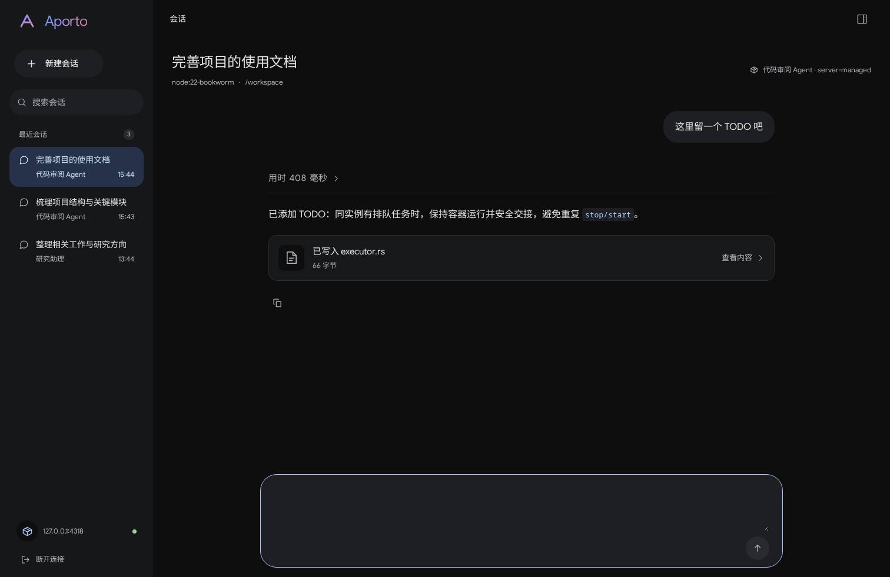

# Aporto Web

React and TypeScript client for the Aporto HTTP/SSE API. Deploy it independently from the Rust server.

The workspace includes agent and runtime selection, conversation history, live execution updates, expandable tool results, and a compact message composer. The desktop and mobile layouts use self-hosted Google Sans Flex and Noto Sans SC.



[Mobile preview](../../docs/images/workbench-mobile.png) · [Conversation model](../../docs/conversation.md) · [HTTP API](../../docs/http-server.md)

## Development

Use Node.js 24 and npm 10 or newer. Node.js 22.12+ on the 22.x release line is also supported.

Start [Aporto Server](../../README.md) first, then run:

```bash
cd apps/web
npm ci
npm run dev
```

Open <http://localhost:5173> and enter the server URL and bearer token. The initial server URL is `http://127.0.0.1:8080`. Configure the server's `--allow-origin` to match the browser origin exactly; `localhost` and `127.0.0.1` are different origins.

The optional `VITE_APORTO_API_URL` build variable changes the initial server URL. Users can still edit it on the connection screen. All `VITE_*` variables are public: never put bearer tokens, model keys, or runtime credentials in them. The client keeps its access token in memory; reloading the page requires entering it again.

## Build and deployment

```bash
VITE_APORTO_API_URL=https://api.example.com npm run build
npm run preview
```

Deploy the complete `dist/` directory with a static web server, including `assets/` and `licenses/`. `npm run preview` is for checking a build locally, not a production server.

Use HTTPS for both the site and API. Allow the site's origin in Aporto Server. Configure the API reverse proxy to preserve SSE streaming, disable response buffering, and allow long-lived connections. The static web server needs no access to model or runtime credentials.

There are no font CDN requests, analytics scripts, or automatic remote image loads. Markdown disables raw HTML and unsafe link protocols; images become links the user can open. Font provenance and redistribution requirements are in [Web fonts](../../docs/fonts.md).

## Source layout

| Path                                                         | Responsibility                                                      |
| ------------------------------------------------------------ | ------------------------------------------------------------------- |
| `src/App.tsx`                                                | Connection screen, session state, and workspace shell               |
| `src/api/client.ts`, `events.ts`, `validation.ts`            | Authenticated HTTP/SSE transport and boundary validation            |
| `src/api/state.ts`, `items.ts`                               | Snapshot reconciliation, pagination, and event deduplication        |
| `src/components/NewThread.tsx`, `useRuntimeInstances.ts`     | Agent, image, runtime instance, and working directory selection     |
| `src/components/ThreadView.tsx`, `useTurnItems.ts`           | Conversation lifecycle, sending, cancellation, and activity loading |
| `src/components/TurnActivity.tsx`, `activityPresentation.ts` | Collapsible execution history and confirmed file results            |
| `tests/`                                                     | Browser tests and an isolated HTTP/SSE fixture server               |

The API types mirror `crates/protocol` DTOs. All timestamps are Unix milliseconds. Snapshots and SSE items merge by stable IDs and sequence numbers; completed turns use canonical `turn.output` for their final answer. Transient disconnections reconnect with a cursor, while invalid protocol data and terminal authorization errors require explicit reconnection. Requests are cancelled when switching conversations or disconnecting. Failed sends retain their idempotency key for retry.

## Validation

```bash
npm run format:check
npm run typecheck
npm test
npx playwright install chromium
npm run test:e2e
npm run build
```

TypeScript checks include unused locals and parameters. Unit tests cover HTTP/SSE parsing and validation, cursor recovery, cancellation, reconciliation, pagination, and activity presentation. Browser tests cover connection, session creation, send/interrupt, streaming and recovery, Markdown safety, memory-only credentials, file results, copying, and responsive layout.

Playwright owns a separate Vite server at `127.0.0.1:4174` and a deterministic API fixture at `127.0.0.1:4318`; both ports must be free. It does not reuse the development or preview server at port 5173. These tests do not call a model or provision a runtime. See [integration validation](../../docs/validation.md) for backend and runtime checks.

Screenshots default to `/tmp/aporto-web-artifacts/`. Set `APORTO_SCREENSHOT_DIR` to choose another directory. To refresh only the conversation previews:

```bash
APORTO_SCREENSHOT_DIR=/tmp/aporto-previews npm run test:e2e -- tests/activities.spec.ts \
  --grep 'shows confirmed file writes below the answer and captures the conversation states'
```

## License

Application code is licensed under [Apache-2.0](../../LICENSE). Bundled fonts retain their [SIL Open Font License](../../docs/fonts.md).
