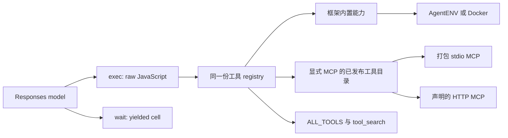

# Agentfile：标准 TOML、PTC 与 Responses 模型配置

Agentfile 是唯一的作者配置格式，使用标准 TOML。本文定义构建、部署、工具目录与线程绑定的完整契约；作者不填写格式版本字段。

## 1. 范围

1. **Agentfile 使用标准 TOML。** 保留 Dockerfile 的构建上下文、显式资源引用、离线编译、内容摘要和可分发产物语义。只维护一种作者格式，不支持自定义块语法、Shell 插值或任意宿主 RUN。
2. **执行机制固定为 PTC。** 模型的顶层 action 只有 `exec` 和 `wait`。作者配置不声明 `TOOLS`、`mode` 或 `workspace_config`。`tools.*` 仍然存在，由引擎注册内置工具和显式声明的 MCP；PTC 需要这些能力来产生实际效果。
3. **独立 `[model]`。** 模型名和类型化请求参数进入 Agentfile/bundle；连接名引用部署中的 Responses connection。当前实现只支持 HTTP Responses，使用 JSON 请求和 SSE 响应，也能读取网关返回的完整 JSON。不开放 Chat Completions、Messages、任意协议插件或 `extra_body`。服务的 HTTP/SSE 过程事件由 Core 持久化，独立于模型传输。
4. **作者只管理两个输入。** Agentfile 定义可打包行为；部署 TOML 定义实际连接和凭据。bundle 和 release 是系统生成的产物，作者不手工维护工具 schema 或 lock 清单。
5. **发布后按 release 固定执行契约。** 离线 build 打包资源；显式 activate 解析目标运行环境和 MCP 工具目录。新线程绑定 release；已有线程不会读取当前配置来替换模型连接、工具目录或 workspace。

当前不支持多模型路由、自动 fallback、模型训练/微调、自动依赖安装、Agent 继承、任意配置 include、OCI registry 发布或多租户授权。每个 Agentfile 定义一个 Agent 和一个模型。更换模型需要新的 bundle/release；UI 可以展示有效模型名称，但普通 turn 请求不能覆盖模型参数。

## 2. 固定 PTC 工具契约

Agentfile 不声明框架内置工具清单。模型的顶层入口固定为 `exec` / `wait`，内部通过统一 registry 调用能力；作者只声明需要打包的资源和外部 MCP。

调用关系固定为：



- 基础 registry 包含 `exec_command`、`read_file`、`write_file`、`read_skill`，以及 `tool_search` 用于查询完整调用声明。作者不逐个开关这些能力。
- 全部能力通过 PTC 调用；MCP 不作为额外顶层 Responses tools 发送。
- 内置工具名、参数 schema、能力语义由编译器选定的 **builtin ABI** 固定进产物。运行器升级不能静默向旧 release 增加工具；不支持旧 ABI 时明确拒绝运行。
- `ALL_TOOLS` 提供当前可调用集合的 `{name, description}`。`tool_search({query, limit})` 只查询同一 registry，返回匹配工具的名称、描述、输入 schema 和可读调用声明。搜索不是授权操作。
- 内置工具默认简短展开在 exec 描述里；较大的 MCP 声明延迟查询。隐藏描述不意味着工具未注册。
- 声明一个 MCP 代表允许纳入这个服务的工具。`include_tools` 是可选收窄条件；不写时在 activate 时自动发现，不需要作者抄写全部工具名称。
- 不提供虚假的只读工具开关：一个可执行任意 shell 的 Agent 已能读写其 runtime 权限允许的文件。真正的只读或网络限制应由运行环境落实，不能仅靠隐藏 `write_file` 名称。

## 3. 与 Codex PTC 对齐的边界

PTC 参考 [Codex 的 exec 契约](https://github.com/openai/codex/blob/9b738582b13c2cdbeff54af0afd04c50c3e7ba09/codex-rs/code-mode-protocol/src/description.rs)。Agentfile 是 Aporto 自身的格式。

| 契约 | 决定 |
| --- | --- |
| `exec` 输入 | 原始 JavaScript，支持顶层 await 与首行 `// @exec: {...}`；不是 JSON 中的一段字符串，也不是 shell 命令 |
| 模型工具编码 | Responses custom/freeform `exec` + function `wait`；exec 使用 text 格式，不要求网关支持额外 grammar 格式 |
| `wait` 参数 | `cell_id`、可选 `yield_time_ms`、`max_tokens`、`terminate`；只接受已返回的运行中 cell ID |
| 输出 | 显式 `text()` 返回；工具值不会自动塞进模型上下文；wait 只返回上次观察后的增量 |
| 编排 | `tools.*`、`ALL_TOOLS`、`tool_search` 来自同一 registry；独立任务支持 Promise 并发，变更操作遵守 broker 串行规则 |
| JS 能力 | 没有 Node、require、直接文件系统或网络 API；副作用必须经过 broker |
| 生命周期 | 使用 Aporto 的 turn 边界：一轮结束清理 cell、PTC KV 和 MCP 进程，runtime 文件跨轮保留；不宣称与 Codex 跨 turn cell 生命周期完全相同 |
| JS 引擎 | 使用 QuickJS；不宣称 V8、完整 ES module 或 Codex 所有媒体 helper 已实现。只有实现过的 helper 才进入 exec 描述 |

`max_tokens` 是模型可见的输出预算；现有按 4 bytes/token 估算的截断只是一种估算预算，不是精确 tokenizer。底层仍以 `max_output_bytes` 作硬上限。

Aporto 固定两个顶层入口，且不会自动发现 workspace 配置。这些约束由代码执行，独立于 prompt 和 skill 内容。

## 4. 两份配置与三个阶段

| 信息 | 唯一来源 | 是否进入 bundle |
| --- | --- | --- |
| Agent 名称、prompt、skill、MCP 代码、资产 | Agentfile 与显式本地资源 | 是，资源内容快照 |
| 模型名称、推理/输出参数、逻辑 connection 名称 | Agentfile `[model]` | 是 |
| Runtime provider、默认 image/template、允许的候选项与默认 workdir | Agentfile `[runtime]` | 是 |
| Responses endpoint、模型认证、额外 headers | 部署 `[connections]` | 否 |
| AgentENV endpoint/key 或 Docker socket/资源限额 | 部署 `agents.runtime` | 否 |
| MCP 所需 secret 的逻辑引用 | Agentfile MCP 配置 | 是，只有引用 |
| secret 的环境变量绑定与实际值 | 部署配置与启动进程环境 | 引用进 release；值不进产物 |
| workspace、用户任务、运行中 sandbox ID | 会话输入与 Core 状态 | 否 |
| 解析后的 runtime identity、MCP catalog、公开连接配置 | activate 生成的 release | 不回写 bundle，持久化为发布记录 |

```text
Agentfile + 显式资源 --build(离线)--> agent.bundle
bundle + 部署配置  --activate----> release（解析、验证、固定外部契约）
release + task/workspace --run---> thread/turn + runtime 文件
```

`build` 不读取模型 key，不连接 MCP，不启动模板，不执行资源脚本。`activate` 是有副作用的部署动作：在临时目标 runtime 中启动 stdio MCP，在 Core 的网络位置连接 HTTP MCP，初始化和查询 tools/list；不调用领域工具 tools/call。模型实际调用需要单独的验证入口或首个任务，不把“配置解析成功”称作“模型支持 PTC”。

## 5. Agentfile 代表例子

```toml
[agent]
name = "reviewer"
description = "审查代码并给出可核查的结论"

[model]
name = "YOUR_MODEL_ID"
connection = "primary"
max_output_tokens = 16384
reasoning = { effort = "high" }
text = { verbosity = "medium" }

[runtime]
provider = "docker"
image = "python:3.12-slim"

[[prompts]]
source = "resources/prompts/reviewer.md"

[[skills]]
source = "resources/skills/code-review"

[[mcp]]
name = "policy"
source = "resources/mcp/policy"
command = ["python3", "server.py"]

[[assets]]
source = "resources/reference/review-format.md"
target = "assets/review-format.md"

[limits.turn]
timeout_ms = 900000
max_model_requests = 24
max_tool_calls = 64
max_parallel_tools = 8

[limits.ptc]
cell_timeout_ms = 30000
memory_mb = 128
max_output_bytes = 65536
```

`YOUR_MODEL_ID` 必须替换成所用服务实际可用、支持 Responses custom tools 的模型 ID。推理/输出参数仅为配置示例，需目标模型支持；不需要时省略对应字段。PTC 与 Responses 是固定协议，无需额外选择字段。

完整示例目录：[examples/agentfile/](../examples/agentfile/README.md)。静态 schema：[Agentfile](agentfile.schema.json)、[部署配置](deployment.schema.json)。配套 JSON Schema 供编辑器或外部工具在 TOML 解析后做结构校验；CLI 使用 Rust typed DTO 与语义校验，不在运行时读取这些 Schema 文件。路径边界、secret 引用和跨文件绑定由 Rust 校验。

### 5.1 根结构与严格性

| 表/键 | 数量 | 语义 |
| --- | --- | --- |
| `[agent]` | 必须 | `name` 必填，`description` 可选 |
| `[model]` | 必须且一份 | 单模型行为与 connection 引用 |
| `[runtime]` | 必须且一份 | Docker image 或 AgentENV template |
| `[[prompts]]` | 0..N，有序 | `source`，可选 role 默认 developer，允许 system/developer |
| `[[skills]]` | 0..N | `source` 指向包含 SKILL.md 的目录，名称和描述从 frontmatter 取得 |
| `[[mcp]]` | 0..N | 唯一名称，stdio 或 HTTP 的明确配置 |
| `[[assets]]` | 0..N | 显式 source 到 assets 命名空间，不注册任何能力 |
| `[limits.turn]` / `[limits.ptc]` | 可选 | 不同生命周期的预算，缺省值见示例 |

| 限额 | 默认值 | 可配置范围 |
| --- | --- | --- |
| `turn.timeout_ms` | 900000 | 1–86400000 ms |
| `turn.max_model_requests` | 24 | 1–1000 |
| `turn.max_tool_calls` | 64 | 1–4096 |
| `turn.max_parallel_tools` | 8 | 1–64 |
| `ptc.cell_timeout_ms` | 30000 | 1–600000 ms |
| `ptc.memory_mb` | 128 | 8–1024 MiB |
| `ptc.max_output_bytes` | 65536 | 256–16777216 bytes |

`[limits.turn].timeout_ms` 从 runtime 与 MCP 初始化完成后开始，限制本轮模型请求及 PTC 执行阶段；它不是从任务入队到清理完成的总墙钟上限。runtime 创建、bundle 安装、MCP 初始化、导出和暂停/删除使用各自的请求超时与取消规则。取消创建时仍等待取得准确 runtime ID 后清理，避免遗留未知资源。其余 turn 限额在每轮执行时重新计数。

所有对象拒绝未知字段，TOML 重复键/表直接报错；不支持 JSON/YAML 文档嵌入、字符串插值、Shell 展开、任意 include 或最后一项覆盖前项。数组有序；名称集合必须唯一。错误不输出 secret 值；解析错误可提供安全的位置提示，语义错误指出相关字段规则。

### 5.2 Model 的精确语义

| 字段 | 规则 | Responses 映射 |
| --- | --- | --- |
| `name` | 非空字符串，最多 512 字节；不维护供应商模型白名单 | `model` |
| `connection` | 部署中唯一匹配的逻辑名称 | 解析 endpoint/auth/headers；不写进请求 body |
| `max_output_tokens` | 可选整数，1..1048576；本地范围不代表上游模型额度 | `max_output_tokens` |
| `reasoning.effort` | 可选非空、最多 32 字符；按配置原值发送 | `reasoning.effort` |
| `text.verbosity` | 可选 low/medium/high | `text.verbosity` |

未配置的可选字段不发送，不默认插入 medium/high，也不把一个模型的参数映射成另一个模型的参数。上游不接受时返回明确失败，不能偷偷删除参数、换模型或换协议。当前实现不开放任意 sampling/extra 参数；需要新增字段时同时增加 typed struct、请求序列化及协议测试。

引擎独占 `input`、prompt 装配、`tools`、`tool_choice`、`parallel_tool_calls`、`store`、`include`、`stream`、`background`、`previous_response_id`、conversation 管理等字段。Agentfile、部署 headers 或 task 都不能覆盖这些字段。

当前实现请求固定 `stream=true`、`store=false`、`parallel_tool_calls=false`，使用本地持久化的 Responses items 继续上下文，并请求/保留支持的 `reasoning.encrypted_content`。SSE 中的助手文本可提前显示；只有完整 completed 响应经过校验后才执行 tool call。保留 custom_tool_call / function_call 与对应 output 的 ID；未知顶层工具、重复 call ID、部分/失败响应均不能执行副作用。网关返回完整 JSON 时使用相同的校验与过程记录路径，无需新增协议选择字段。

不自动重试整轮任务或已执行工具。模型请求失败的重试只有在能够判定尚未执行工具、并保留请求与响应状态时才允许；中断/崩溃后不重放已提交副作用。opaque reasoning 和工具历史不能假定可跨模型、端点或账号继续使用。

### 5.3 Runtime

```toml
[runtime]
provider = "docker"
image = "python:3.12-slim"
images = ["python:3.13-slim"]
workdir = "/work/review"
```

```toml
# AgentENV：在 Agentfile 中替换整个 [runtime] 表
[runtime]
provider = "agentenv"
template = "aporto-python"
templates = ["aporto-python-extra"]
workdir = "/work/review"
```

- `provider=docker` 必须有 `image`，可选 `images`；禁止 `template/templates`。`provider=agentenv` 必须有 `template`，可选 `templates`；禁止 `image/images`。没有 provider 默认值或失败后 backend fallback。
- `image/template` 是默认选项，始终自动加入允许列表。`images/templates` 只增加候选项，按作者顺序排列；默认项也可在列表中出现一次，构建时消除该冗余。列表内部重复项报错，有效候选项包含默认项最多 16 个，每个引用最多 512 字节；Docker 引用不得含空白或以 `-` 开头。
- 新线程或 CLI `run --image REF` 只能选择已激活的候选项，省略时使用默认项。候选项都在同一 provider 和 deployment 下；它们不是失败重试或自动 fallback 列表。
- 每个 image/template 引用参与 bundle digest。activate 逐项启动环境、安装 bundle、发现 MCP 并清理，分别记录实际 image ID、daemon identity 和 catalog；全部成功才发布 release。Docker tag 后续变化不改变任何已固定的候选镜像。
- `workdir` 默认为 `/workspace`，是容器或 sandbox 内的绝对目录，不是宿主挂载路径。接受并消除一个结尾 `/`；禁止根目录、`.`、`..`、重复 `/`、反斜杠、控制字符及 `/opt/agent`、`/.aporto`、`/tmp/.aporto*` 等内部资源目录。目录最多 4096 字节。未配置或显式配置默认值时不增加产物字段。
- 命令和文件工具以所选 workdir 为工作目录；目录初始化由 broker 完成。CLI `run --workdir DIR` 可显式选择同样通过验证的容器内目录；`--workspace` 仍表示待上传的宿主文件快照。它们不建立宿主 bind mount，也不自动加载目录中的 Agent 配置。
- AgentENV local/remote 属于部署连接方式，不放进 Agentfile；相同模板契约可连接不同部署。不同 deployment 的同名 template 不视为同一内容。跨 deployment template ID 映射和可验证内容同一性属于后续明确能力，当前实现不自动替换模板 ID。
- AgentENV 若无法从服务取得可验证的不可变模板标识，release 记录 `runtime_identity.verification = "agentenv_unverified"` 和所用 template 引用及服务绑定；不能伪造 digest 或宣称整个环境可复现。
- runtime 提供解释器和系统依赖。Docker 保留 Python 3/POSIX sh、可写工作目录、禁止镜像 VOLUME、本机 Unix socket等既有契约；这些要求由 preflight 验证。

### 5.4 Prompt、Skill 与资源路径

Prompt 按 TOML 数组顺序读取并装配，默认 developer；显式 system 保留给受信任作者，框架约束仍由代码校验。运行 workspace 的 AGENTS.md 不自动拼接；需要它时必须作为 `prompts.source` 显式打包。

Skill 整个目录打包，名称/描述来自 SKILL.md frontmatter，构建时检查入口、重复名称和 UTF-8。模型首先收到轻量技能目录，正文经 `tools.read_skill` 从经过校验的 bundle 读取；脚本/附属资源保留相对结构，运行它们仍须经过 runtime 工具。Skill 不是自动注册的函数；其正文/allowed-tools 字段不能改变 registry。

普通 source 相对 build context；外部本地目录使用显式 named context：

```toml
[[skills]]
source = "@shared/skills/code-review"
```

```sh
aporto build ./my-agent --context shared=/absolute/local/shared \
  --output ./dist/reviewer.agent.json
```

不会把整个 context 默认复制进去，也不扫描父目录、HOME、.agents 或 .codex。构建使用 `.agentignore` 和默认秘密文件排除规则，并拒绝路径穿越、symlink、FIFO 和设备文件。命中忽略规则的显式引用报错；目录内部忽略项跳过；缺失资源直接报错。

单文件最多 8 MiB，总内容最多 64 MiB，最多收录 10000 个文件、扫描 20000 个目录项；读取 bundle 的文件上限为 100 MiB。构建输入应为受信任的只读快照：路径检查不能抵御并发进程恶意替换祖先目录。

TOML中的 `${HOME}`、`~`、`$()` 和 `{secret=...}` 出现在普通字符串时都是普通字符；只在 schema 允许的结构化 secret 对象中有注入语义。prompt 是文本，不展开环境变量。绝对 source 路径仍通过 CLI 的 named context 显式接入，不写入产物。

`assets.target` 只能位于 assets/ 下；不能覆盖 prompts/skills/mcp 或生成的 manifest。文件部署到 `/opt/agent/`，运行目录采用所选 workdir，默认为 `/workspace`。asset 不产生工具、技能或隐式指令。

### 5.5 MCP 与 secret

```toml
[[mcp]]
name = "docs"
url = "https://docs.example.com/mcp"
include_tools = ["search", "fetch"]  # 可省略；空数组不是禁用语法，应直接删除此 MCP
[mcp.headers]
Authorization = { secret = "DOCS_AUTH" }

[[mcp]]
name = "private_policy"
source = "resources/mcp/policy"
command = ["python3", "server.py"]
[mcp.env]
LOG_LEVEL = "info"
POLICY_TOKEN = { secret = "POLICY_TOKEN" }
```

对应部署中的 secret 绑定（只为实际声明的 MCP 添加）：

```toml
[agents.secrets]
DOCS_AUTH = { env = "MCP_DOCS_AUTH" }
POLICY_TOKEN = { env = "POLICY_API_TOKEN" }
```

- `command` 与 `url` 严格互斥；从字段推导 stdio/HTTP，不声明 `transport`。stdio 可有 source/env；HTTP 可有 headers，不能有 source/command/env。
- stdio argv 不是 shell 字符串。可执行文件由 runtime 的固定镜像提供；有 source 时 cwd 固定为 `/opt/agent/mcp/<name>`，`server.py` 相对该包目录；无 source 时 cwd 固定为 `/opt/agent`。不依赖任务 workspace。
- HTTP MCP 由 Core 连接显式 endpoint，Docker network=none 不约束这条控制面连接。activate 与 run 使用相同网络位置、transport 和 secret 引用。HTTP MCP endpoint 不允许内嵌认证、query/fragment；header 使用结构化 secret 引用。禁止覆盖 Host、Content-Length、Content-Type、Accept、Transfer-Encoding、Connection、MCP-Session-Id、MCP-Protocol-Version 等协议头。
- Secret 对象本身形成 required_secrets；不需要独立 SECRET 声明。header 的 secret 值原样注入，因此 Authorization 若采用 Bearer，环境变量内容包含完整的 `Bearer ...`。
- MCP env 普通变量可为字符串，敏感名称必须引用 secret。URL/argv/prompt 无通用秘密插值；未绑定 secret 在 activate 前报错，不带值打印。
- 模型 key、AgentENV key 和 Docker socket权限始终留在控制面，不传给任务程序。stdio MCP secret 只注入声明的进程，但同一 sandbox 中的 shell 和 MCP 不构成秘密隔离边界；若不允许 Agent 取得某个服务秘密，应使用 Core 发起的 HTTP MCP 或另行隔离服务。

## 6. 部署 TOML

```toml
[connections.primary]
endpoint = "https://api.openai.com/v1/responses"
api_key = { env = "OPENAI_API_KEY" }
timeout_ms = 120000

[[agents]]
id = "reviewer"
bundle = "./dist/reviewer.agent.json"

[agents.runtime]
host = "unix:///var/run/docker.sock"
memory_mb = 512
cpus = 2
pids_limit = 128
network = "none"
```

`[connections]` 是 Responses 连接，不是通用 provider 插件。多个 Agent 可以引用同一个 connection，各自的模型名称与参数仍来自其 bundle。当前实现模型认证支持 Bearer API key，实际值只从显式 env 引用解析。

endpoint **只接受完整请求 URL**，例如 `https://gw.example/api/v1/responses` 或已经提供 Responses 的自定义路径。CLI 与 Core 使用同一个解析器，原样保留路径，不追加 `/v1` 或反复剥离/追加 `/responses`。不同时支持 base_url，避免两个参数互相猜测。禁止内嵌 userinfo、query、fragment；需网关注入固定查询参数的部署暂不支持，必须显式报错。

可选 `[connections.primary.headers]` 的普通值为字符串，秘密值为 `{env="ENV_NAME"}`；例如 `x-source = {env="MODEL_SOURCE"}`。header 名称大小写不敏感地去重；禁止覆盖 Authorization、Host、Content-Length、Content-Type、Transfer-Encoding、Connection 等引擎所有字段。密码类 header 不接受明文字面量。

相对 bundle 路径相对部署文件目录，不相对启动 cwd。部署文件不从 runtime workspace 搜索，不自动读取 `.env` 或 `~/.codex`；凭据只从显式环境变量引用解析。

### 6.1 AgentENV 的 local/remote

```toml
# local 的 agents.runtime，bundle 必须为 AgentENV provider
[agents.runtime]
mode = "local"
api_url = "http://127.0.0.1:8000"
api_key = { env = "AENV_API_KEY" }
lease_ms = 300000
```

```toml
# remote
[agents.runtime]
mode = "remote"
api_url = "https://aenv.example.com"
sandbox_url = "https://aenv.example.com"
api_key = { env = "AENV_API_KEY" }
lease_ms = 300000
```

部署 runtime 不重复 provider。解析 bundle 后，按其 provider 严格验证对应结构；Docker配置不能带 mode/api_url/key，AgentENV 配置不能带 docker host/image。local API 地址必须为 loopback，缺省仍为 localhost:8000；remote 必须显式 API URL。TLS、URL 与凭据错误均失败，不降级到另一种 backend。

### 6.2 激活与运行

```sh
aporto build ./my-agent -o ./dist/reviewer.agent.json
aporto activate --config ./deployment.toml --agent reviewer
aporto run --config ./deployment.toml --agent reviewer --task '审查项目' \
  --workspace /absolute/path/to/project
```

`activate`、`run`、Core 和 HTTP Server 均可用 `--releases-dir DIR` 指定同一发布目录，默认是部署文件所在目录下的 `releases/`。Core 启动前必须完成显式 activation，启动服务不会隐式创建 runtime 或刷新工具目录。`aporto-core --config deployment.toml` 和 Server 的 `--core-config deployment.toml` 使用同一部署文件。Core 启动时加载发布快照；重新激活后需受控重启 Server/Core，让新线程采用新的 active release。CLI 每次 run 读取当前 active release。

### 6.3 配置优先级

没有任意深度 merge、模型配置 override 或环境扫描。唯一解析顺序是：schema 默认值 → bundle 中显式行为 → 部署连接/资源绑定 → secret provider 的值。各层拥有不同字段，不互相覆盖。新线程可从已发布候选项中选择环境并指定容器内工作目录；请求不能选择 endpoint、宿主挂载路径或额外工具。

Secret 值不入 bundle、release digest、公开事件或日志。release 固定 secret handle/env 引用；在同一逻辑账号下轮换值不重打包。**仅凭环境变量名无法证明新值仍属同一账号**：当前实现不声称固定了可验证的凭据主体。换账号应使用新的 connection/secret handle 并发布新 release；旧 handle 不得重定向到另一个账号。旧凭据不可用时旧线程失败，不回退当前配置，也不删除 opaque reasoning 来强行继续。未来接入能提供 identity/version 的 secret manager 后再强化这一保证。

## 7. Build 产物与可复现边界

build 按 parse → typed validation → 路径与依赖引用检查 → 有界快照 → canonical manifest → digest 执行。TOML注释、排版、mtime、宿主绝对路径不进入语义摘要；有语义顺序的 prompt 数组必须保留顺序。

```text
aporto.bundle
  manifest
    agent / model / runtime
    prompt entries / skill catalog / mcp declarations / assets
    limits
    generated builtin_abi / ptc_abi / secret dependency names
    model.connection keeps the logical model connection name
  files
    normalized package path -> bytes + content digest + executable mode
  digest
    canonical manifest-and-files SHA-256
```

bundle 使用有界 JSON/base64 格式，适合轻量资源。Python / Node / native 大型依赖由 runtime image/template 或显式准备的 vendor 资源提供。npx/uvx、动态 imports、下载脚本和绝对 shebang 不会因为复制目录而自动变得可移植。

因此“文件快照可复现”“runtime 镜像/模板身份可验证”“HTTP MCP 外部行为可复现”是三件事。build 只能保证第一件；activate 记录后两者的已知状态。catalog hash 固定工具接口，不证明远程实现或模型供应商权重没有变化。签名和发布者信任也不由内容摘要代替。

## 8. Activation、工具目录与 release

1. 加载并验证 bundle，解析所有逻辑 connection/secret；不读 workspace。
2. 固定公开有效模型连接与请求参数、runtime binding 及其服务 namespace；解析可用的不可变 image/template identity。
3. 按默认项优先的顺序，对每个候选 image/template 创建专用临时 runtime，安装同一 bundle，使用与任务相同资源/网络/进程配置启动 stdio MCP。HTTP MCP 从 Core 侧使用同一配置连接。每个 Docker 候选项分别固定 image ID，并确认属于同一个 deployment daemon。
4. tools/list 完整分页，执行数量和累计大小限制。先校验所有候选名称、重复项、schema；只选择 include_tools 或此刻的全部服务工具。
5. 固定原始名称→PTC规范名称、description、input/output schema、annotations 和协商的 MCP 协议；拒绝名称归一化碰撞、外部 $ref 和缺失的 include_tools 项。所有 registry 消费者使用同一规范化器。
6. 为当前候选项生成 registry/catalog 快照；内置工具的 ABI 和 schema 内容一同进入 release 摘要。不同镜像的 MCP 目录可以不同，执行时只能使用所选项的 catalog。模型预检结果若执行过应独立记录，不能由 tools/list 成功推定模型成功。
7. 关闭当前临时 MCP、删除临时 runtime，再检查下一个候选项；清理未确认时报告失败和准确 ID，停止后续候选项，不发布该 activation。调用者断开或取消后，supervisor 仍等待在途创建取得 ID 并完成清理。
8. 将 bundle、catalog、有效公开配置和 ABI 要求实际持久化，再在发布锁内原子替换 `active.json`，将 agent 指向新 release。指针替换前失败保留原 active release；如果替换后的目录同步失败，调用报告错误但切换结果可能已经可见，部署者必须重新读取活动指针与对应 release 后确认状态，不应假设已回滚。

运行时重连 MCP，只允许 release catalog 中的工具。新增服务工具忽略；选中工具缺失、description/schema/被使用的 annotations变化则报 `tool_contract_changed`，不刷新正在运行的 registry。若希望纳入新工具或契约，重新 activate 生成新 release。

release 至少包括：bundle digest、有效模型名/参数、connection 公共配置及引用、runtime binding/service namespace、runtime identity 状态、完整 MCP catalog、PTC/builtin ABI、依赖产物实际内容位置。不能只保留摘要或一个日后可被覆盖的配置文件路径。

默认项的目录和身份保存在 `catalog/runtime_identity`，非默认项保存在 `variants[reference].catalog/runtime_identity`。没有非默认项时省略 `variants`。验证要求候选列表与快照一一对应，不能遗漏候选项、添加未声明项或将默认项重复写进 variants；所有目录、身份和映射都参与 release 摘要。

## 9. Thread 与恢复

新线程保存 `agent_id + release_id`、bundle digest 和 sandbox ID；provider 与 runtime namespace 从固定 release 绑定取得。运行环境模板/镜像身份与这个运行中 workspace ID 是不同字段。Responses history、turn事件和workspace生命周期继续由 Core 管理。

读取旧线程时先加载它的不可变 release，不用当前 agent 配置重建执行条件。修改 endpoint、模型参数、runtime socket、MCP接口或 Agentfile 都只影响新 release/新线程。被线程引用的 release、bundle和catalog不得自动回收；缺少旧 ABI、镜像、模板或凭据时明确报告不可恢复，不创建另一个工作区冒充原会话。

Docker stop/start、AgentENV pause/connect 保留原有 provider 语义。终止任务会取消 PTC与MCP，再执行runtime清理；未结束的工具操作不因重连自动重放。跨模型或 release 继续工作时显式新建线程，Responses history 不跨模型复用。

## 10. Rust 模块边界

实现保持 Core / HTTP Server / UI 的独立边界：

| 模块 | 责任 |
| --- | --- |
| `agentfile` | TOML DTO、默认值、类型/引用验证、带位置的错误；不访问模型/runtime |
| `build` | 显式资源快照、canonical bundle、完整性校验；不执行 MCP |
| `model` | 唯一请求构造器、typed model options、Responses items；CLI/Core共用 endpoint语义 |
| `broker` / `broker::catalog` | 固定 builtin ABI、MCP catalog、schema校验、名称映射；提供PTC与搜索的一致视图 |
| `release` | activation、不可变发布对象、active指针、凭据引用和runtime identity |
| `core::executor` | 根据thread release执行，不临时合并当前profile；管理取消/持久化 |
| Server/UI | 只使用版本化Core协议，展示 Agent、模型与 release 标识以及 runtime 进度事件；不解析Agentfile或持有上游key |

使用成熟 Rust TOML parser，DTO `deny_unknown_fields`，运行前编译输入schema。不创建多协议provider trait或通用模板语言。源TOML→typed AST→normalized manifest→resolved release各有独立类型，避免同一个结构在构建和运行时被补写字段。

## 11. 验收矩阵

| 场景 | 必须验证的结果 |
| --- | --- |
| 无TOOLS/mode/protocol字段 | build通过，顶层恰好exec/wait，内置registry自动生成 |
| 在model加入tools/input/extra_body | typed配置校验拒绝，不能改变请求的PTC契约 |
| 配置name/reasoning/text/max_output_tokens | 捕获实际Responses body逐字段核对；省略项完全不发送 |
| 自定义完整endpoint含多级路径 | CLI/Core发送到完全相同路径，无重复/responses或/v1 |
| 模型返回不支持参数、非completed、未知工具 | 明确失败，不换协议/模型、不执行工具 |
| MCP无include_tools | activate发现并固定目录，作者不手工维护工具名 |
| MCP新增/删除/改schema或description | 新增不自动开放；已选契约变化拒绝；新activation才纳入 |
| tool_search/ALL_TOOLS/tools | 查询返回的每个工具都可调用且来自同一snapshot，无目录外授权 |
| workspace/HOME污染MCP/skill/AGENTS.md | 不进入prompt/catalog/registry；显式文件读取仍只是任务数据 |
| source穿越、绝对路径、symlink、缺失/被忽略资源 | 失败且无秘密值输出；named context合法引用可打包 |
| 只换secret值 | bundle不变；值不进日志/产物；不把账号一致性说成已自动验证 |
| 改公开connection、模型参数、runtime或catalog | 新release；旧thread保持旧release或明确无法恢复 |
| activation初始化/cleanup/指针替换前落盘失败 | 原active release不变，残留资源准确可定位 |
| 活动指针替换后的目录同步失败 | 明确报告错误，按未确认发布处理；重新读取指针及release确认状态 |
| Docker与AgentENV配置混用 | 交叉验证失败，不做backend fallback |
| 服务重启 | 读取release实际内容，同一runtime namespace/sandbox恢复，历史不跨模型重放 |
| 真实验收 | 真实模型→exec→内置/MCP→runtime；两轮、取消、重启重读、UI展示与文件独立核对 |

格式、引用和执行语义需要分别验证。TOML 与 JSON Schema 校验只能证明格式内部一致；Rust 测试、进程级测试及所选 runtime 与真实模型的联合验证见 [validation.md](validation.md)。发布时应记录对应 commit 与实际执行结果。

## 12. 参考与实现入口

- [Codex PTC 描述](https://github.com/openai/codex/blob/9b738582b13c2cdbeff54af0afd04c50c3e7ba09/codex-rs/code-mode-protocol/src/description.rs)：exec globals、工具发现与生命周期。
- [Responses API](https://platform.openai.com/docs/api-reference/responses)：模型协议参考；目标服务的具体参数与 custom tools 支持需单独验证。
- [Agent Skills specification](https://agentskills.io/specification)：SKILL.md 元数据和资源结构。
- [`src/agentfile.rs`](../src/agentfile.rs) 与 [`src/build.rs`](../src/build.rs)：作者输入、验证和打包。
- [`src/release.rs`](../src/release.rs)：activation、不可变 release 和工具目录。
- [`src/model.rs`](../src/model.rs) 与 [`src/broker.rs`](../src/broker.rs)：Responses 请求、PTC 与工具授权。
- [`crates/core/src/executor.rs`](../crates/core/src/executor.rs)：持久会话的执行与 runtime 生命周期。
