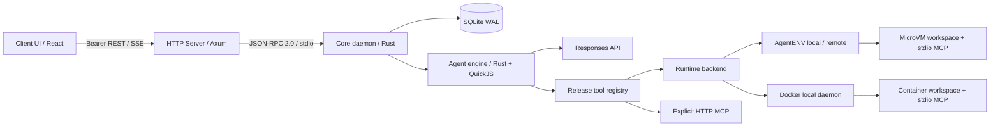
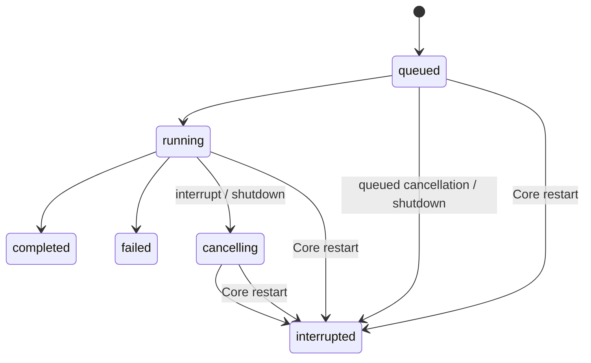

# Core / Server / Client 架构

Aporto 是自定义 Agent 的构建与运行框架，覆盖 Agentfile 定义、资源打包、部署激活和任务执行，并通过 Core 提供持久会话与工作区管理。Rust Core 管理应用状态和执行；独立 Rust HTTP Server 适配网络；独立 React/TypeScript Client UI 展示和提交任务。三者保存在同一个独立仓库，分别构建和部署。Core 不依赖 HTTP 或 UI，Server 的生产依赖不包含执行引擎。

## 模块与进程



| 模块 | 所有权与职责 | 独立交付 |
|---|---|---|
| 根 `aporto` crate | Agentfile 构建、bundle 校验、PTC、model、tool broker、AgentENV / Docker adapter | Rust SDK 和单任务 CLI |
| `aporto-protocol` | 版本、JSON-RPC、thread/turn/item/event 数据结构与 JSON Schema | Rust crate / 生成 schema |
| `aporto-core` | deployment、release、SQLite、调度、history、runtime 生命周期、恢复 | `aporto-core` 可执行程序；也可嵌入 SDK |
| `aporto-core-client` | 请求复用、背压、Core 子进程存活、超时与失败传播 | Rust client crate |
| `aporto-server` | 身份校验、REST、SSE、CORS、连接与请求限制 | `aporto-server` 可执行程序 |
| `apps/web` | Agent/会话选择、消息、进度、取消、重连、历史分页 | 单独 npm 包、静态 `dist` |

引擎内部将能力授权与传输细节分开：`broker.rs` 管理 release registry、参数校验和调度，`broker/mcp.rs` 管理 MCP 会话与请求，`broker/mcp/sse.rs` 只负责增量分帧；`runtime.rs` 选择 backend，`runtime/agentenv.rs` 管理 AgentENV 连接、租约和 sandbox 状态，`runtime/agentenv/process.rs` 管理 envd 进程流，`runtime/agentenv/wire.rs` 固定 protobuf 数据结构，`runtime/docker.rs` 管理 Docker 容器、exec 和文件传输。Server 的事件分页校验与 SSE 位于 `events.rs`。UI 的 `api/validation.ts` 校验网络数据，`api/state.ts` 协调快照合并与刷新，组件只负责交互和呈现。

Server 为自己的 state directory 启动一个 Core，不能让两个 Core 同时拥有同一目录。独立 Core 进程也可直接供 IDE、其他 Server 或本地 CLI 客户端使用。当前 stdio 接口是一对一的 supervisor 通道，不是可任意共享的远程 RPC 服务。共享远程访问通过 HTTP Server。

## 与 Codex app-server 的关系

参考其应用服务边界、initialize 协商、thread/turn 生命周期、客户端隔离、事件处理和背压设计。这里定义 Aporto 进程协议，不宣称兼容 Codex JSON-RPC 方法的全部字段或插件协议。PTC 只暴露 `exec` 和 `wait`；QuickJS 执行 async function body。嵌套工具通过 broker 路由，没有把 shell 伪装为 PTC，也没有引入平行的普通 function-calling 模式。

`exec` 的每个 cell 有自己的 QuickJS runtime、内存和时间限制。独立工具调用可在 JavaScript 内使用 `Promise.all` 并发；PTC `store/load` 在单个用户 turn 内保留。用户 turn 结束时关闭所有 cell，下一个 turn 的 PTC 内存为空。跨 turn 保留的是 runtime workspace 的文件和已提交的 Responses history。

cell ID 带有随机会话前缀，历史消息中的旧 ID 不能观察或取消新 turn 的 cell。调用次数、参数大小和 pending callback 数量在创建 native async future 前检查，避免 JavaScript 同步 fanout 绕过异步调度限额。

## Agentfile 与部署配置分层

Agentfile 是能力和内容的构建输入，详细语法、路径、上下文、秘密、确定性和边界见 [Agentfile 规范](agentfile.md)。构建产物包含 manifest、prompt、skills、stdio MCP 文件及各文件摘要。启动 Core 时校验整个产物并固定在内存中；原始构建目录不再参与执行。

部署配置是运维管理的 TOML，包含逻辑模型连接、Agent ID、bundle 路径和 runtime 绑定。它不由模型或浏览器提交，也不从 workspace 搜索。Agentfile 的 `[model]` 固定模型名称及参数，通过 `connection` 引用部署连接；`[runtime]` 固定 provider、默认及可选镜像/模板和默认工作目录。部署只绑定目标连接和资源限额。

```toml
[connections.primary]
endpoint = "https://model.example.com/v1/responses"
api_key = { env = "MODEL_KEY" }
timeout_ms = 120000

[connections.primary.headers]
x-source = "aporto"
x-provider-token = { env = "PROVIDER_TOKEN" }

[[agents]]
id = "reviewer"
bundle = "reviewer.agent.json"

[agents.runtime]
mode = "remote"
api_url = "https://aenv.example.com"
sandbox_url = "https://aenv-data.example.com"
api_key = { env = "AENV_API_KEY" }
lease_ms = 300000
```

CLI/Core 使用同一 Responses 完整 endpoint，不猜测 base URL。相对 bundle 路径相对部署目录；`{ env = "NAME" }` 只绑定指定变量，默认不读 `.env` 或用户 Codex 配置。MCP secret 在 Agentfile 用 `{ secret = "NAME" }` 引用，在 `[agents.secrets]` 用 `NAME = { env = "ENV_NAME" }` 绑定。

Docker 部署的 `[agents.runtime]` 使用 `host`、`binary`、`memory_mb`、`cpus`、`pids_limit`、`network`，不重复 provider 或 image；AgentENV 使用 mode、API / sandbox URL、api_key 与 lease。两种字段不得混用。完整示例见 [Docker deployment](../examples/server/deployment-docker.toml)、[AgentENV local](../examples/server/deployment-agentenv-local.toml) 和 [AgentENV remote](../examples/server/deployment-agentenv-remote.toml)。

`aporto activate --config deployment.toml --agent reviewer` 显式连接 runtime 和 MCP，固定工具目录、实际镜像/模板身份、公开连接与凭据引用。临时资源清理确认后才原子发布 active release。Core 启动要求已激活的 profile，既不自动激活，也不从当前部署重新构造历史线程的行为。

release 保存实际 bundle/catalog 内容，线程持久化 release ID。变更模型、endpoint、runtime 设置或 MCP 契约时重新激活；服务受控重启后新线程选择新的 active release，已有线程继续加载原 release。Docker activation 逐个固定允许的 image ID 与各自的工具目录，之后 tag 指向变化不影响原 release。AgentENV 无法证明模板不可变身份时明确记录 unverified；同名 template 跨服务不视为同一环境。

Docker daemon 只支持绝对 Unix socket URL，network 只允许 none/bridge。默认 none 限制 guest 网络，不阻止 Core 连接模型或 HTTP MCP。runtime owner 由 profile 和固定发布契约生成，部署不能覆盖；控制面凭据不会传入 guest。

## 持久化与事务

SQLite 使用 WAL、`synchronous=FULL`、foreign keys、schema version 和独占进程锁。state directory 权限为 0700，数据库与锁为 0600。schema 分离 runtime_instances、threads、turns、events 与过程记录：

- runtime_instance 固定 Agent、release、bundle、provider、镜像及初始工作目录，持久化实际 sandbox ID；仅管理 Aporto 分配的实例。
- thread 固定 `runtime_instance_id` 和会话工作目录，保存独立的最后成功 Responses history；公开 sandbox ID 从实例记录读取，供共享会话实时看到首次分配结果。
- turn 保存 input、status、answer/error、时间、idempotency key 和输入摘要。
- event 保存全局递增 sequence、thread/turn、kind、JSON data、时间。sequence 可以跨 thread 有空洞。
- item 保存助手消息、PTC 调用和工具调用的最新公开快照，与对应事件原子提交；按首次创建的 ordinal 排序，更新不改变位置。

状态和对应事件在同一个事务提交后才响应。`turn/start` 将任务写成 queued，再交给有限 worker。SQLite partial unique index 保证一个 thread 至多存在一个 queued/running/cancelling turn；另一个 partial unique index 保证同实例至多有一个 running/cancelling turn。worker 按实例互斥，直到执行清理和结果提交后才释放；队列跳过被占用实例，避免阻塞其他实例的任务。

幂等键范围为 `(thread_id, idempotency_key)`。同 key 同 input 返回原 turn（包括终态）；同 key 不同 input 返回 conflict。网络超时意味着请求结果可能未知，客户端应使用原 key 查询/重试，不能生成新 key 重试副作用。

公开历史默认最新 20 turn，并有按实际 JSON 大小计算的帧预算；`before=next_cursor` 继续读取更早记录，返回按时间顺序排列。thread 列表和 event 分别分页。RPC frame 最大 2 MiB，event page 有序列化预算，避免历史不断增长造成无限响应。

完整模型历史最大 8 MiB，超过则失败并要求新建 thread；当前没有自动压缩或静默丢弃上下文。公开 answer 最大 32 KiB。不能把这些字节预算解释成模型 token 上限。输入、工具结果和 reasoning 都可能包含业务敏感数据，数据库须按任务数据保护，使用加密磁盘和受控备份；当前不提供数据库列级加密。

## turn 状态与取消



`turn/interrupt` 取消执行 token。取消 queued turn 立即从队列移除。运行中的模型请求、PTC 和工具走各自取消/清理流程。cancel 是请求停止，不是回滚已经发生的文件写入或外部 MCP 操作。断开 HTTP/SSE 连接不取消 turn。

Core 重启时把所有未完成 turn 标为 interrupted，并记录恢复事件，不自动重试工具或重放队列。下一轮使用最后成功 history，并注入受信任的恢复提醒：上一次失败/中断可能已改变工作区，先检查现状。当前不能恢复执行到某个 JavaScript await，也不声称外部工具恰好执行一次。

队列、worker、RPC inflight、输入/输出/history/event 都有上限；HTTP 层对普通请求和长连接分别限制。SIGTERM/Ctrl-C 触发有界 graceful shutdown，超出宽限期标记 interrupted 并终止剩余任务。Core client 不自动重启或重试写请求；异常退出时所有 pending 请求失败。

## sandbox 生命周期

新会话默认新建一个尚未分配容器的实例，可从 release 的允许列表选择镜像并覆盖默认工作路径。首轮才分配实际容器。复用通过 `runtime/instances` 选择同 Agent 已持久化的实例，只沿用原 release 和镜像；新会话从空历史开始，文件属于共享实例。空实例及不可加载的 release 不出现在可复用列表中。列表不主动探测容器；外部删除后不会静默创建替代品。

工作目录默认 `/workspace`，允许指定其他非根绝对 guest 路径；命令、文件工具、每轮模型上下文使用同一目录。拒绝路径穿越及 `/opt/agent` 等保留资源目录。目录创建失败会终止该轮，原实例 ID 仍保留。MCP 目录与配置来源始终由 bundle 决定。

Core 通过 `open_backend` 创建或恢复 runtime，立刻提交 `runtime.ready` 与 `sandbox_id`，之后才初始化 broker/调用模型。`sandbox_id` 在 Docker backend 下保存容器 ID；协议和数据库字段不变。正常 turn 结束先关闭 PTC/MCP，再调用 `ManagedRuntime::pause()`。该接口统一“停止活动并保留文件”的用途，具体语义见下表。

| backend | 首次运行 | turn 结束 | 下一轮恢复 | 未知结果的兜底 |
|---|---|---|---|---|
| AgentENV | 创建 secure sandbox、`autoPause=true` | VM pause，保存文件和 VM 状态 | connect 原 sandbox，更新 token/lease | lease 到期尝试 autoPause |
| Docker | 用本地镜像创建受管理容器 | stop 容器，保留 rootfs | start 原容器，进程重新启动 | 无 lease/autoPause，需运维检查 |

下一轮（包括 Core 重启后）只恢复持久 ID 指向的工作区。404、认证失败、归属或镜像不一致、暂停/恢复冲突直接失败，不创建替代工作区。线程使用原 release 的实际内容恢复；当前部署变更不替换它。原 release、凭据或 runtime 不可用时明确失败。`runtime.paused.confirmed` 表示 backend 对 pause/stop 是否确认成功；失败会保留 ID 并报告 turn 失败，不把未确认清理当作成功。

### AgentENV

第一轮通过 `/v2/sandboxes` 创建 sandbox，结束时请求 `/sandboxes/{id}/pause`。lease renewal 只在活动 runtime 对象存活期间进行。下一轮用持久 ID 调用 `/v2/sandboxes/{id}/connect`，取得新的 envd access token 并延长 lease，随后使用原实例和会话工作目录。

创建 sandbox 和提交 SQLite 不是跨服务事务。create 请求已生效但网络响应丢失、或进程在落盘前崩溃时，可能留下未绑定 sandbox；它依赖 AgentENV TTL/autoPause 和运维对账清理。pause 失败停止续租，记录未确认事件并报告失败；保留 ID，后续仍显式恢复原 sandbox。autoPause 保存工作区，不代表删除存储。

AgentENV runtime 分别记录 active、detached、paused、deleted 状态。发起清理即关闭数据操作并停止续租，只有收到成功响应才确认 pause/delete；失败或被取消的请求允许显式重试。成功 pause 后仍可 delete，delete 的 404 视为已经删除。命令 deadline 包含 envd Start 握手和后续流读取。

envd 取消会尝试杀死直接进程；后台子孙进程、MCP 外部副作用不能由取消保证清理。暂停会冻结 VM，恢复可能恢复进程；高隔离部署应配套 guest 进程组 supervisor、MCP 服务策略与超时。

### Docker

Docker adapter 使用配置的 CLI 和 Unix socket 管理容器，模型工具只在容器内执行。首次创建时固定镜像 ID、资源限制和网络设置，记录受管理标签、owner 与镜像标识。恢复时 adapter 核验这些标识，不能借由持久 ID 操作其他 profile 或外部创建的容器。

`pause()` 执行容器 stop；rootfs 中的文件保留，VM/进程内存和运行位置不保留。下轮启动同一个容器，并重新初始化 packaged MCP 和 PTC。资源限制来自创建时的容器配置；修改部署配置不会重建已有 thread 的容器，应创建新 thread 使用新设置。

显式 stop/remove 返回失败后只报告失败并保留可重试状态，不在对象析构时异步补发同一清理请求，避免误停下一轮刚恢复的共享实例。下一次 Docker open 在启动前同步确认并停止上次活动；取消等待者时，已有创建/清理 supervisor 仍负责完成正在进行的操作。

Docker 没有 AgentENV 的 TTL 或自动暂停保证。Core 被强制终止、daemon 请求结果丢失或 stop 失败时，容器可能继续运行；创建与落盘之间崩溃也可能留下未绑定容器。运维应按 managed/owner 标签与持久 ID 对账，检查并停止或清理遗留容器。容器隔离边界不同于 AgentENV MicroVM，daemon socket 权限属于受信任的运维权限。

单任务 CLI 通常在结束时删除 runtime；若显式文件导出失败，则尝试 pause/stop 并保留原 ID 供恢复产物。Core 为跨 turn 持久性保留工作区。当前没有 thread 删除/归档/存储 GC API，生产需明确 VM、容器 rootfs 和数据库的保留周期、配额与运维清理机制。

## 协议与 Client UI

`initialize` 协商 `protocol_version=1.0`，其余方法为 `agent/list`、`runtime/instances`、`thread/start`、`thread/list`、`thread/read`、`turn/start`、`turn/interrupt`、`item/list`、`event/list` 和 `shutdown`。请求/响应独占 stdout，诊断写 stderr。大帧、非法 JSON、未知方法、版本不匹配明确拒绝。

协议类型在 `crates/protocol`；通过 `cargo run -p aporto-protocol --example export-schema` 导出 [JSON Schema](protocol.schema.json)。HTTP 方法、状态码、鉴权、SSE 和部署示例见 [HTTP Server](http-server.md)。

UI 使用 fetch 接收 SSE，Bearer 在 header 中，不放 URL；token 只保存在内存。每个 event 使用 `id=sequence`、`event=agent_event`，data 为完整 Event。恢复使用 `after` 或 `Last-Event-ID`，按 sequence 去重。`item.started/updated/completed` 携带可恢复的累计过程快照：助手的中间说明和回答，以及工具/PTC 输入、输出、状态与耗时。部署凭据在持久化前脱敏；system/developer prompt、原始 reasoning 与 encrypted history 不进入公开事件。终态后读取 thread/turn 的权威状态。

模型层使用 Responses SSE，助手文本限频更新，兼容返回 JSON 的 Responses 网关。只在完整 completed 响应经过校验后执行工具。Core 支持多轮完整 Responses history 和 encrypted reasoning 回放；公开过程记录独立分页，不膨胀 thread 快照。UI 与服务可分别开发/部署，不依赖桌面 Codex。详见 [对话过程协议](conversation.md)。

## 生产边界与验收门槛

当前落实的是单租户、受信任操作者环境：一个 Server token 可读写这个 state directory 的全部 thread。没有多用户 RBAC、租户隔离、OIDC、审计导出、HA 调度或 PostgreSQL。不要通过复制 SQLite 目录或共享网络盘实现多副本；扩展多租户时，先定义 principal → tenant → profile/thread 的授权，再迁移一致性与执行租约。

QuickJS 是进程内原生库，JS 内存/CPU 配额和无宿主 API 是能力边界，不是原生漏洞隔离。Core 与 HTTP 分进程降低直接耦合，但共享同一 Core 的多 thread 不能视为彼此抵御原生漏洞的安全沙箱。面向不可信租户的生产部署必须再加独立 PTC worker 进程/容器、OS 资源限制和凭据隔离。

上线验收至少包括所选 backend 的真实文件/MCP/并发/取消/暂停恢复与模型联合测试、崩溃和断网注入、请求与事件压力测试、磁盘耗尽/备份恢复、受控网络/TLS/密钥轮转、runtime 与数据库保留策略。Docker 验收需要真实 daemon、已加载镜像和 stop/start 文件保留检查；不能用其结果代替 AgentENV 模板、envd、Firecracker 与 lease 验收。测试入口与覆盖范围见 [验证指南](validation.md)。仓库自动化测试使用 AgentENV 协议 fixture，真实 AgentENV / Firecracker 仍需在目标部署独立验收。

## 参考

- [OpenAI Codex](https://github.com/openai/codex)：设计参考 `9b738582b13c2cdbeff54af0afd04c50c3e7ba09` 的 app-server/client 分层与生命周期。
- [AgentENV](https://github.com/kvcache-ai/AgentENV)：wire adapter 对照 `34cdc8098096726646853a18cec7ae143995dcef`，包含 sandbox create/connect/pause、lease 和 envd Connect/protobuf。
- [Responses API](https://platform.openai.com/docs/api-reference/responses) 与 [function calling](https://platform.openai.com/docs/guides/function-calling)：完整输出项回放和 custom/function tool 入口。
