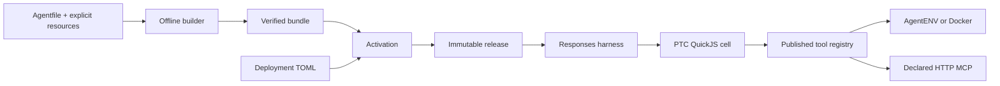

# Aporto 执行引擎设计

Aporto 以标准 TOML Agentfile 显式定义 Agent，经离线构建与运行环境激活后，通过 Codex 风格 PTC 执行任务。完整字段、打包与发布契约见 [Agentfile 规范](agentfile.md)；Core / HTTP Server / Client UI 与持久会话见 [应用架构](architecture.md)。

## 构建和执行边界



Agentfile 固定模型行为、runtime provider / image / template、Prompt、Skill 和 MCP 声明。Deployment 绑定模型完整 Responses endpoint、环境变量凭据引用、runtime 连接与资源限额。构建和部署各自拥有不同字段，不做隐式覆盖或 workspace 配置合并。

`build` 只快照显式资源，校验路径、文件类型、大小、UTF-8 入口与引用，再计算 canonical manifest 和文件摘要。注释、mtime 和宿主绝对路径不影响 digest。bundle 使用有界 JSON / base64，避免 tar 解包路径风险；它不是 OCI image，操作系统和第三方运行依赖由 image/template 提供。

`activate` 在临时目标 runtime 安装同一 bundle，初始化 stdio MCP；HTTP MCP 从控制面连接。发布目录保存实际 bundle、模型连接、runtime 绑定、工具目录和 ABI 要求。临时资源清理确认后才原子更新 active release。运行时不能因部署变化或 MCP 新增工具而改写已有线程的契约。

文件内容可复现、runtime 镜像身份可验证与外部 HTTP MCP 行为可复现是不同保证。Docker 使用解析后的 image ID；AgentENV 未提供不可变模板身份时记录 unverified。内容摘要不替代发布者信任或签名，也不固定远程模型权重和 MCP 实现。

## PTC 语义

模型只看到 Responses custom `exec` 与 function `wait`。`exec` 接受原始 JavaScript，支持顶层 await 和首行 pragma；`wait` 接受已返回的运行中 cell ID、输出预算 `max_tokens`、yield 时限与 terminate。Shell、文件和 MCP 通过 `tools.*` 执行，不作为额外顶层工具发送。

```javascript
const definitions = await tools.tool_search({query: "policy", limit: 5});
text(definitions);
const results = await Promise.allSettled([
  tools.read_file({path: "README.md"}),
  tools.mcp__policy__review_policy({})
]);
text(results);
```

工具 registry 同时生成可调用 `tools.*`、轻量 `ALL_TOOLS` 和 `tool_search` 的输入 schema 与声明。内置能力固定为 exec_command、read_file、write_file、read_skill、tool_search；作者不维护 TOOLS 清单。Skill frontmatter、用户任务、MCP 返回值和 workspace 文件不能注册新能力。

每个 cell 创建独立 QuickJS runtime，没有 Node、直接文件系统、网络或宿主环境 API。`store/load` 为一个用户 turn 中显式共享的 JSON 状态；正常完成或抛错完成会提交已有写入，显式终止不提交。不同 cell 按完成提交顺序覆盖同名 key。这不是文件或外部副作用事务。

`yield_time_ms` 或 `yield_control()` 返回 running cell ID 后脚本继续。`wait` 只消费尚未返回的输出，完成后关闭 cell；观察操作串行化避免重复消费。脚本主 Promise 结束后未 await 的工作被取消。输出须显式 `text()` 返回，可先在 JavaScript 中过滤和汇总。

独立读操作可以 Promise 并发；命令、写入和不确定的 MCP 操作由 broker 串行。调用次数、参数大小与 pending callback 数量在 native async future 创建前检查，防止同步 fanout 绕过异步限额。cell 时间、内存、输出、活动数、KV 及工具结果各有界。`max_tokens` 使用字节估算，不是精确 tokenizer，底层输出字节硬上限仍生效。

turn 结束清理所有 cell、PTC KV 与 MCP 进程；下一 turn 创建新执行上下文。只有 runtime 文件与已提交 Responses history 跨 turn 保留。cell ID 带会话随机前缀，旧历史不能操作新 turn 的 cell。没有执行中 cell 的跨进程恢复、媒体输出、完整 ES module 或多 Agent 调度。

## Responses 模型连接

`[model]` 只允许名称、connection、max_output_tokens、reasoning.effort、text.verbosity。可选字段省略时不发送，上游拒绝参数时明确失败，不静默删参数、换模型或换协议。endpoint 使用完整 HTTP(S) URL，CLI/Core 共享相同解析与路径规则。

引擎拥有 input、tools、tool_choice、store、stream、previous_response_id 等控制字段。请求采用 Responses JSON、stream=true、store=false、parallel_tool_calls=false，增量解析 SSE，并保留本地 Responses items 与 encrypted reasoning。助手文字可提前显示，只有校验通过的 completed 响应才执行工具；未知工具、重复 call ID、未完成或失败响应不能触发副作用。返回完整 JSON 的 Responses 网关走相同的验证路径。

`[limits.turn].timeout_ms` 只限制 runtime / MCP 初始化后的模型与 PTC 执行阶段；初始化、导出和清理遵循各自的请求超时与取消规则，不计入这个预算。

模型请求和工具不会因网络失败自动整轮重放。失败 turn 可能已改变 runtime，恢复后要求先检查状态。Opaque reasoning / history 不跨模型、endpoint 或账号隐式复用。Server 的 SSE 是持久进度事件，独立于模型传输是否流式。

## MCP、Skill 与秘密

MCP `command` 与 `url` 二选一，分别推导 stdio 与 Streamable HTTP。stdio command 是 argv，cwd 固定为打包目录；不依赖任务 workspace，也不继承宿主环境。HTTP 支持 JSON 和 SSE 响应，服务端 sampling、elicitation 等工作流不在执行契约内。

MCP 工具在 activation 自动发现，可通过非空 `include_tools` 精确收窄。工具名称归一化为 `mcp__server__tool` 并拒绝碰撞；schema 本地校验，不获取外部 `$ref`。运行时忽略新增工具，已发布工具缺失或契约改变则失败，重新 activation 才生成新目录。

Skill 目录包含 SKILL.md frontmatter 和关联资源。模型先收到 name/description，正文由 `read_skill` 从控制面已验证 bundle 读取；目录内脚本仍需 runtime 工具运行。guest 可写文件不会变成指令的信任根。

MCP `{ secret = "NAME" }` 自动形成依赖，deployment 用 `{ env = "ENV_NAME" }` 绑定。只在解析引用的受控位置注入，没有字符串插值和独立 SECRET 声明。模型与 AgentENV 控制面凭据不进入 guest；同一 runtime 内的 shell 和 stdio MCP 不构成秘密隔离边界。HTTP MCP 在控制面联网，不受 guest network=none 限制。

## Runtime 与持久性

AgentENV local 仅连接 loopback；remote 使用显式 API/sandbox URL，两者共用 REST / Connect protobuf adapter。API key 用于控制面，envd 使用返回的 sandbox access token。任务运行续 lease，取消沿 PTC → broker → process/RPC 传播；服务轮末 pause，下轮 connect 原 ID。

Docker 使用本机 Unix socket 和已加载镜像，无宿主挂载，默认无网络、无 capabilities，并限制内存、CPU 和 PID。服务轮末 stop，下轮 start 保留 rootfs；进程内存不保留。镜像必须提供 Python 3 / POSIX sh，禁止 VOLUME。完整约束见 [Docker runtime](docker-runtime.md)。

单任务 CLI 先完成有界 workspace 快照再创建 runtime，上传到所选工作目录（默认 `/workspace`）；显式 export 后正常删除环境。导出失败尝试暂停/停止并保留 ID，不能把未确认导出当作成功。Core 保存线程的 release 与 sandbox ID，只恢复原环境，失败时不创建替代 workspace。

AgentENV 依赖 lease/autoPause 兜底，Docker 没有 TTL；崩溃可能在创建和持久化之间留下资源。运维需要按准确 ID 与归属对账。任何取消都不回滚已发生的文件或远端 MCP 副作用。

## 生产边界与验收

QuickJS 是控制面内的原生库，内存/CPU 配额与禁用宿主 API 不等同于原生漏洞隔离。多租户部署需要独立 PTC worker 进程/容器、OS 限制、凭据与授权隔离。当前服务面向受信任操作者的单租户部署。

验收应分别覆盖离线构建、Responses body、工具目录变化、release / 线程固定、真实 runtime、恢复、取消、清理失败、秘密不落盘与 UI。检查入口见 [验证指南](validation.md)，HTTP fixtures 不代表 Firecracker E2E。

真实 AgentENV 验收还需部署合格服务，分别完成 local/remote 的命令、文件、stdio / HTTP MCP、并发、取消与 pause/connect，并在 workspace/HOME 放置冲突配置验证不会自动加载。仓库自动化测试使用 AgentENV 协议 fixture；真实 microVM 验收需单独进行，不能用 Docker 或真实模型测试代替。

后续独立能力包括 OS 层 PTC 隔离、审计导出、自动模板构建、签名 OCI 分发、workspace volume/artifact 和上下文压缩。它们不引入另一种作者配置格式。

## 参考

- [Codex PTC 契约](https://github.com/openai/codex/blob/9b738582b13c2cdbeff54af0afd04c50c3e7ba09/codex-rs/code-mode-protocol/src/description.rs)：exec globals、工具发现与生命周期。
- [AgentENV](https://github.com/kvcache-ai/AgentENV/tree/34cdc8098096726646853a18cec7ae143995dcef)：sandbox create/connect/pause、lease、envd Connect/protobuf。
- [Agent Skills specification](https://agentskills.io/specification)：SKILL.md 元数据、资源目录与逐步加载。

这些参考用于说明协议和设计来源，不构成接口兼容或外部性能承诺。
